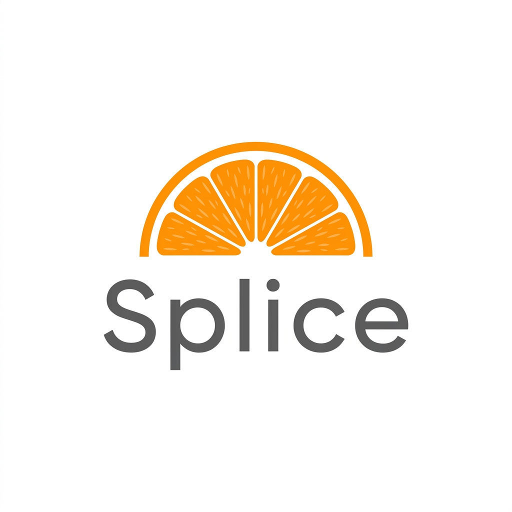

<div align="center">
  

  <h1>Splice Enterprise</h1>

  <p><strong>The Agent-Native Browser Infrastructure.</strong><br/>
  Not a browser for humans. A browsing engine for AI.</p>

  
  
  
  
  
</div>

---

## The Problem

Standard browsers were built for human eyes. When AI agents use them, they inherit the **Human Tax** — the massive overhead of parsing visual noise, unstructured HTML, and unpredictable rendering. This leads to hallucinations, failed interactions, and exploding token costs.

## The Solution

Splice is a Model Context Protocol (MCP) server that functions as an intelligent translation layer. It wraps a Playwright browser and converts raw web pages into **high-density, structured JSON streams** tailored for AI consumption. Every tool it exposes is purpose-built for agents.

---

## Features

### Semantic Lenses
Agents don't just "see" a page — they see it through a specialized lens.

| Lens | What It Extracts |
|---|---|
| `UX` | Interactive elements, buttons, forms, links, visible text |
| `Security` | External scripts, hidden inputs, insecure forms, CSP flags |
| `Performance` | Large images, deep DOM trees, render-blocking nodes |
| `Vision` | Returns base64 screenshots for multi-modal analysis |

### Token Budget Engine
Pass `maxTokens` to `get_semantic_tree_optimized` and Splice guarantees it never exceeds your context window. It progressively truncates long text blocks and list overflow until it fits. No more `context_length_exceeded` errors in production.

### Vibe Coding Mode

| Tool | Description |
|---|---|
| `capture_annotated_screenshot` | Injects neon bounding boxes with ID labels onto every interactive element and returns a screenshot. Point-and-click agent navigation. |
| `execute_script` | God-Mode. Run arbitrary JavaScript in the live browser context for zero-friction DOM manipulation. |

### Speculative "Fork-Ahead" Execution
Call `speculative_fork(urls)` to pre-load a list of URLs into background branches. When your agent later calls `navigate`, it gets an instant cache hit — zero loading time.

### Ghost Protocol
Splice launches via `playwright-extra` with the **stealth plugin** active. It automatically erases headless fingerprints so your agents are invisible to aggressive bot detection on financial, legal, and enterprise sites.

### Control Center
Call `generate_observability_report` at any time to generate a live HTML dashboard showing the Causal Replay Timeline, Speculative Cache Map, and session metrics.

### Shadow Testing
Use `fork_state` to clone the current browser state into a background branch. Test risky interactions without polluting the primary session, then `commit_branch` if it succeeds.

### Human-in-the-Loop (CAPTCHA Triage)
When a CAPTCHA is detected:
1. If `TWOCAPTCHA_API_KEY` is set — attempts automatic resolution silently.
2. If unsolvable — spawns a **visible Chromium window** on the host machine for manual intervention, then resumes the headless session once solved.

### Deterministic Snapshots
`save_snapshot` serializes the full browser session (cookies, localStorage, auth tokens) to an encrypted local file. `load_snapshot` restores it instantly — agents can teleport into authenticated states without re-logging in.

---

## Quickstart

### Prerequisites
- Node.js 18+
- `npx playwright install chromium`

### Installation

```bash
git clone https://github.com/Arnavnemade1/Splice.git
cd Splice
npm install
npm run build
```

### Configure your MCP Client

**Claude Desktop** — add to `~/Library/Application Support/Claude/claude_desktop_config.json`:

```json
{
  "mcpServers": {
    "splice": {
      "command": "node",
      "args": ["/absolute/path/to/Splice/dist/index.js"]
    }
  }
}
```

**Cursor / Windsurf** — add to `.cursor/mcp.json`:

```json
{
  "mcpServers": {
    "splice": {
      "command": "node",
      "args": ["/absolute/path/to/Splice/dist/index.js"]
    }
  }
}
```

> After updating the config, restart your AI client to activate Splice.

---

## Tool Reference

| Tool | Key Arguments | Description |
|---|---|---|
| `navigate` | `url` | Navigate the active branch to a URL. Speculative cache-aware. |
| `get_semantic_tree_optimized` | `intent`, `lens`, `maxTokens` | Extract the AI-optimized DOM tree. |
| `interact` | `elementId`, `action`, `value` | Click, type, select, focus with auto-wait resiliency. |
| `capture_annotated_screenshot` | — | Visual DOM map with neon element labels. |
| `execute_script` | `script` | Inject arbitrary JavaScript into the page. |
| `speculative_fork` | `urls` | Pre-load URLs in background branches. |
| `fork_state` | — | Clone current session for shadow testing. |
| `commit_branch` | `branchId` | Promote a background branch to active. |
| `save_snapshot` | `name` | Persist session state locally. |
| `load_snapshot` | `name` | Restore a saved session instantly. |
| `capture_node_screenshot` | `elementId` | Base64 screenshot of a specific element. |
| `debug_failure` | `sessionId` | Save a Playwright time-travel trace for debugging. |
| `generate_observability_report` | — | Generate the Splice Control Center HTML dashboard. |
| `request_human_intervention` | `reason` | Spawn a visible browser for CAPTCHA or manual unblocking. |

---

## Environment Variables

| Variable | Description |
|---|---|
| `TWOCAPTCHA_API_KEY` | Enable automatic CAPTCHA solving via 2Captcha. |

---

## Project Structure

```
Splice/
├── src/
│   ├── index.ts              # MCP Server — tools & resources
│   ├── BrowserManager.ts     # Core orchestration engine
│   ├── SemanticExtractor.ts  # Semantic Lens & Token Budget Engine
│   ├── TelemetryInterceptor.ts # Network & console log capture
│   └── types.ts              # Shared TypeScript types
├── dashboard/
│   └── index.html            # Splice Control Center template
├── assets/
│   └── logo.png
├── INTEGRATION.md            # Guide to integrating Splice into agent projects
└── dist/                     # Compiled output (run this)
```

---

## Integration Guide

For detailed instructions on connecting Splice to your own agent swarms, including the Ace Trading Daemon, see [INTEGRATION.md](./INTEGRATION.md).

---

<div align="center">
  <sub>Built for agents. Not for humans.</sub>
</div>
