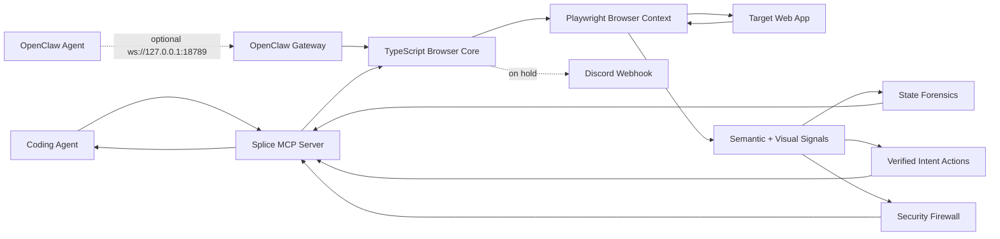

<div align="center">

# Splice

### Browser cognition infrastructure for autonomous coding agents

[](https://github.com/Arnavnemade1/Splice/actions)
[](https://opensource.org/licenses/MIT)
[](https://www.typescriptlang.org/)
[](https://www.python.org/)
[](https://modelcontextprotocol.io/)

Splice gives AI coding agents a browser they can understand, audit, and recover inside. It does not stop at screenshots, raw DOM, or accessibility snapshots. Splice diagnoses browser state, compiles intent into verified actions, redacts hostile page content, and records the evidence agents need to keep moving safely.

[Quick Start](#quick-start) · [Why Splice](#why-splice) · [Flagship Features](#flagship-features) · [OpenClaw](#openclaw-gateway) · [Architecture](#architecture) · [Security](#security-model)

</div>

---

## Why Splice

**Splice does not run its own agents — it supercharges yours.** Keep Claude Desktop, Claude Code, Cursor, Aider, or your custom MCP client and your own prompting style. Add Splice as an MCP server, and the agent you already have becomes dramatically more reliable, debuggable, and safe on real web apps.

Modern web agents fail in boring, expensive ways: stale refs, hidden modals, disabled buttons, route transitions, validation traps, login expiry, CAPTCHAs, and silent clicks that did nothing. Most browser tools expose more page data. Splice exposes browser understanding.

### Cognition, not just execution

Execution-focused browser tools answer "how do I click that?". Splice answers the questions that actually burn agent runs: *why did that fail, what should I do instead, did it actually work, and can I trust this page?*

| Capability | Execution-focused tools (Browser Use, Steel, agent-browser, AutoBrowser, …) | Splice |
| --- | --- | --- |
| Click / type / navigate | ✅ | ✅ |
| Explain *why* an action failed (forensics with evidence + confidence) | — | ✅ `diagnose_agent_state` |
| Detect that the agent is stuck and predict if retrying will work | — | ✅ predictive trend layer |
| Preconditions, postconditions, risk, and alternatives before acting | — | ✅ `compile_verified_action` |
| Verify the action actually worked afterwards | — | ✅ post-action verification |
| Prompt-injection redaction before page text reaches the agent | — | ✅ always on |
| Secret egress firewall on outbound requests | — | ✅ always on |
| Crash self-healing + reproducible run journal | — | ✅ runtime reliability engine |
| Live per-agent performance tracking with in-run corrective directives | — | ✅ agent optimizer |
| Observe only what changed instead of re-reading the whole page | — | ✅ delta observations |
| Wait on a semantic condition instead of polling with reads | — | ✅ `wait_for` |
| Fill an entire form with per-field verification in one call | — | ✅ `fill_form` |
| Extract structured rows without selectors or scraping | — | ✅ `extract_structured` |
| See auto-handled dialogs, popups, downloads, and failing requests | — | ✅ page & network cognition |
| Detect wasted tokens mid-run and steer the agent to cheaper reads | — | ✅ token efficiency engine |
| Remember which fixes worked on a domain and recommend them next time | — | ✅ recovery memory |
| Local observability dashboard with exportable audit evidence | — | ✅ Command Center |

The goal: make Splice the default cognitive and safety layer for the MCP agent ecosystem — the layer every agent stack assumes is there, the way systems assume a kernel.

| Agent problem | Splice answer |
| --- | --- |
| "Why did that click fail?" | Agent State Forensics classifies obstruction, validation, auth, loading, CAPTCHA, network, or missing-target states. |
| "Which element should I use?" | Verified Intent Actions rank candidates, produce preconditions, postconditions, risk, alternatives, and optional execution. |
| "Did the action actually work?" | Post-action verification checks page change, diagnosis state, text evidence, and domain constraints. |
| "Can the page inject instructions?" | Prompt-injection scanning redacts hostile text before it reaches the agent. |
| "Can a site leak secrets?" | Egress firewall blocks outbound secret patterns in non-GET requests. |
| "What happened during the run?" | Command Center renders timeline, forensics, verified plans, branches, audits, and telemetry. |
| "What if the browser crashes mid-run?" | The Runtime Reliability layer auto-relaunches, rebuilds crashed branches, and restores last-known URLs — no restart required. |
| "Can I reproduce a failed run?" | The append-only Run Journal records every tool call (redacted args, outcome, duration, error code) as JSONL on disk. |
| "Is my agent thrashing?" | Agent Tracking profiles every agent live and injects corrective optimization directives into tool responses mid-run. |
| "Do I have to re-read the whole page every step?" | Delta observations return only added/removed/changed elements and navigation transitions, with snapshot-hash staleness detection. |
| "Why relearn the same fix every run?" | Recovery memory persists which action recovered each failure state per domain and recommends it in future diagnoses. |

---

## Flagship Features

### Runtime Reliability Engine

Autonomous agents run for long stretches without human intervention, and the browser is the least reliable component in the loop: Chromium processes die, pages crash, networks blip, and calls hang. Splice treats these as recoverable runtime events instead of fatal errors.

- **Self-healing browser** — if the Chromium process dies or a page crashes, the next tool call transparently relaunches the browser, rebuilds affected branches, and restores each branch's last known URL. The agent resumes where it left off.
- **Typed error taxonomy** — every tool failure returns a machine-readable envelope with a stable `code` (`BROWSER_CRASHED`, `NETWORK_TRANSIENT`, `TARGET_NOT_FOUND`, `TIMEOUT`, `CAPTCHA_REQUIRED`, …), a `recoverable` flag, and a `suggestedNextTool`, so agents can branch on failure class instead of parsing prose.
- **Bounded retries and hard deadlines** — transient network failures are retried with exponential backoff inside Splice; every tool call has a per-tool deadline so a hung page can never stall the agent loop forever.
- **Run Journal** — an append-only JSONL log at `.splice/journal/` records every tool call with redacted arguments, outcome, duration, and error code. After a crash or a surprising outcome, the journal replays exactly what the agent did and in what order.
- **Process-level guards** — unhandled rejections and uncaught exceptions are journaled and absorbed rather than killing the server; `SIGINT`/`SIGTERM` trigger a graceful shutdown that flushes the journal and closes the browser cleanly.

```json
{
  "name": "get_runtime_health",
  "arguments": {}
}
```

```json
{
  "browserConnected": true,
  "activeBranch": "main",
  "browserCrashCount": 1,
  "lastRecoveryAt": 1783536451617,
  "branches": [
    { "branchId": "main", "lastKnownUrl": "https://example.com/", "crashed": false }
  ],
  "journal": { "toolCalls": 132, "errors": 3, "crashes": 1, "recoveries": 1 }
}
```

### Agent Tracking & In-Action Optimization

Splice tracks every tool call attributed to an agent (pass `agentId` on any core tool) and computes live health: success rate, rolling recent success rate, latency, failure streaks, and an error-class breakdown. The tracker turns that health into ranked optimization directives — and delivers them **in-action**: when an agent's live health degrades, the corrective directive is appended directly to its next tool response, so course-correction happens mid-run instead of in a post-mortem.

```text
[AGENT OPTIMIZER (critical)] 3 consecutive failures — stop retrying blindly and
classify the browser state first. → call diagnose_agent_state
(recent success rate 0%, 3 consecutive failure(s))
```

Directives are derived from live signals, for example:

| Signal | Directive |
| --- | --- |
| ≥3 consecutive failures | Stop retrying; classify the browser state via `diagnose_agent_state`. |
| Repeated `TARGET_NOT_FOUND` | Element IDs are stale; re-extract the semantic tree. |
| >40% raw `interact` failure rate | Compile intents into verified actions with precondition gating. |
| `CAPTCHA_REQUIRED` in recent window | Request human intervention or load an authenticated snapshot. |
| Repeated timeouts/network blips | Enable resource blocking and check runtime health. |
| High average latency | Pass a `maxTokens` budget and narrow intents. |

Query the full picture at any time:

```json
{
  "name": "get_agent_analytics",
  "arguments": { "agentId": "executor-2" }
}
```

The Command Center renders each tracked agent as a performance card — status (optimal / degraded / critical), success bar, latency, failure streak, and its top directive.

### Agent State Forensics

Splice can diagnose the current browser state before an agent wastes another step — and it watches the trend across diagnoses: if the same failing state recurs 3+ times on one URL, the diagnosis flags `trend.likelyStuck` and forecasts whether repeating the current approach can work.

```json
{
  "state": "ui_obstruction",
  "confidence": 0.89,
  "summary": "The agent is likely blocked by a visible overlay, modal, or pointer obstruction.",
  "evidence": [
    "Visible dialog or overlay may be intercepting actions: \"Subscribe to continue\".",
    "Current agent goal: submit checkout form"
  ],
  "recommendedNextAction": {
    "tool": "compile_verified_action",
    "target": "close/dismiss control",
    "reason": "Dismiss the obstruction before continuing the workflow."
  }
}
```

Use the MCP tool:

```json
{
  "name": "diagnose_agent_state",
  "arguments": {
    "goal": "submit checkout form",
    "lastActions": ["filled email", "clicked continue"]
  }
}
```

### Verified Intent Actions

Splice compiles natural-language intent into a browser action plan with evidence, an `expectedOutcome` forecast, and — with `includeVision: true` — a pixel crop of the chosen target (`targetPreview`) so a vision model can confirm the DOM pick matches what is actually on screen.

```json
{
  "intent": "click the pricing link",
  "confidence": 0.91,
  "risk": "low",
  "plan": [
    {
      "action": "click",
      "target": "a-12",
      "why": "Best semantic and visual match: \"Pricing\" scored 34."
    }
  ],
  "preconditions": [
    "Target a-12 is visible.",
    "Target a-12 is enabled.",
    "Target a-12 is not visually obstructed at its center point."
  ],
  "postconditions": [
    "URL, title, focused element, or visible page text should change in a way consistent with the intent."
  ]
}
```

Use the MCP tool:

```json
{
  "name": "compile_verified_action",
  "arguments": {
    "intent": "click the pricing link",
    "execute": true,
    "constraints": {
      "noNavigationOutsideDomain": true,
      "avoidDestructiveActions": true
    }
  }
}
```

### Semantic Extraction

Splice generates AI-optimized semantic trees with lenses for UX, security, performance, network, behavior, and vision workflows. Intent pruning and token budgets keep page observations compact without losing actionable controls.

Every full-tree response includes a `snapshotHash` identifying the observation.

### Delta-Based Observations

On long sessions, re-reading the entire tree after every step is redundant — most of the page never changes. Pass `deltaOnly: true` to `get_semantic_tree_optimized` (with the **same** `intent` as your previous read, since intent pruning changes which elements are visible) to receive only what changed since your last observation:

```json
{
  "deltaOf": "1f0c72a9b4e3",
  "snapshotHash": "4f53cda18c2b",
  "url": { "before": "https://shop.example/cart", "after": "https://shop.example/checkout", "changed": true },
  "title": { "before": "Cart", "after": "Checkout", "changed": true },
  "added": [{ "id": "button-14", "type": "interactive", "text": "Place order", "tag": "button" }],
  "removed": [{ "id": "button-9", "text": "Proceed to checkout", "tag": "button" }],
  "changed": [{ "id": "generic-3", "field": "text", "before": "3 items", "after": "3 items — $42.00" }],
  "unchangedCount": 27,
  "summary": "navigated https://shop.example/cart → https://shop.example/checkout; title \"Cart\" → \"Checkout\"; 1 added, 1 removed, 1 changed, 27 unchanged"
}
```

Optionally pass `lastSnapshotHash` (the `snapshotHash` from your last observation): if it no longer matches the server baseline, Splice returns the full tree instead (`fullTreeRequired: true`, with the fresh `tree` included) so you never act on a stale diff. The first `deltaOnly` call on a branch also falls back to the full tree and establishes the baseline — a single call always yields a usable observation.

On live pages full of tickers, timestamps, and counters, add `structuralOnly: true` to suppress text-only mutations: only added/removed elements and value changes are reported, with `textChangesIgnored` counting what was filtered. Every delta also carries `estimatedTokensSaved` — what it would have cost to receive the full tree instead.

**Action-anchored deltas.** Every state-changing call (`navigate`, `interact`, `fill_form`, executed `compile_verified_action`) returns an `actionId` and captures an unpruned post-action snapshot (the last 12 are kept). Pass it back as `sinceLastActionId` to ask *"what changed since action act-N?"* across any number of intervening calls — not just since your last read. Anchored diffs are unpruned on both sides, so intent-based pruning can never fabricate changes; an aged-out or unknown anchor falls back to the full tree with the known anchors listed.

**Re-render detection.** When a framework re-creates a node (new splice-id, identical content), naive diffs report a phantom remove+add pair. Splice pairs those by content signature and reports them separately as `rewrittenIds` (`{ from, to, text }`) — identity churn never masquerades as a real page change, and the agent learns the replacement id for free.

Executed verified actions attach the same structure as `plan.delta`, so post-action verification tells you exactly what the action changed on the page. Deltas are computed per branch, so forked shadow branches keep independent baselines — and `speculative_fork` snapshots each pre-loaded branch and reports how it differs from the active one (elements unique to the pre-loaded page, active-branch elements it lacks), so an agent can pick the right branch without visiting each one.

### Act & Observe Primitives

Four purpose-built primitives replace the most token-expensive agent patterns:

- **`wait_for`** — semantic waiting. Block until the first of your conditions holds (`text_present`, `text_gone`, `element_visible`, `element_hidden`, `url_matches`, `title_matches`, `network_idle`) instead of polling with repeated tree reads. Never errors on timeout: you get `timedOut: true` plus a hint distinguishing "still loading" from "settled without the change".
- **`fill_form`** — batch verified form fill. Pass fields as human labels (`{ field: "work email", value: "a@b.com" }`); Splice resolves each to a control by label / `aria-label` / `aria-labelledby` / placeholder / name, fills it (text, textarea, select, checkbox, radio, **and custom ARIA widgets** — `contenteditable`, `role="textbox"`, `role="combobox"`, `role="switch"`), verifies by readback, and reports per-field status with the control kind and browser-native validation state. Honest about failure: `not_found`, `readback_mismatch`, `skipped_disabled`, and an `ambiguous` flag (with the runner-up label) when the match was a near-tie so a mislabeled field never silently lands in the wrong control. Optionally pass `submitIntent` to submit with full verification once the form is ready — and when it can't, `submit.reason` says exactly why (`not_submittable`, `form_not_ready`, `no_submit_control`). One call instead of N interact+observe round-trips.
- **`extract_structured`** — schema-driven extraction. Name the fields you want and Splice pulls clean rows from the best matching structure — a table (headers matched to your fields), repeated cards, or label/value pairs — with per-field coverage and confidence. No selectors, no scraping in your context window.
- **`assert_page_state`** — cheap verification. Evaluate expectations (`url_contains`, `title_contains`, `text_present`, `text_absent`, `element_visible`, `element_hidden`) in one pass with per-expectation evidence. A fraction of the cost of a tree read; ideal for postconditions between actions.

### Network & Event Cognition

- **`get_network_activity`** — lifecycle-tracked requests (method, URL, status, duration, failure reason) with aggregates and an insight sentence: *"Most recent problem: POST /api/checkout → 500."* Filter by URL fragment, failures only, or a lookback window. Answers "did my submit actually fire, and did it succeed?" without a screenshot.
- **`get_page_events`** — the events a DOM-only observer never sees. Native dialogs are auto-handled non-destructively (alerts accepted, confirm/prompt dismissed) and recorded with their message; popups are recorded with their URL; downloads are saved to `.splice/downloads` with the path recorded. When a click "did nothing", check here first.

Intent resolution is action-aware: a typing intent structurally prefers editable controls and can never resolve to a button, no matter how well the button's label matches. `interact` also supports `hover`, `clear`, `check`, `uncheck`, and `scroll_into_view`, and `navigate` accepts `back` / `forward` / `reload` for history navigation with the same stabilization pipeline.

### Token Efficiency Engine

Splice actively hunts for tokens an agent is wasting and steers it to cheaper observations:

- **Redundant-read detection** — when a full tree read returns content identical to the previous read, Splice counts the re-sent tokens (`metrics.redundantObservationTokens`) and attaches a `[Token Optimizer]` hint to the response telling the agent to switch to `deltaOnly`.
- **Per-agent token accounting** — every tool response attributed to an `agentId` is sized (`tokensReturnedEstimate` on the agent profile). An agent averaging heavy full-tree reads gets a `use-delta-observations` directive inline — even while healthy, because efficiency hints pay for themselves.
- **Compact plans** — pass `compact: true` to `compile_verified_action` to trim the response to essentials (plan, confidence, risk, `expectedOutcome`, verification verdict + delta summary), dropping alternatives and compile-time evidence.
- **Savings ledger** — token savings from pruning and deltas accumulate in `metrics.tokensSavedEstimate` and render as a stat tile in the Command Center.

### Recovery Memory

When a verified action successfully recovers a non-ready state (dismissing an overlay, fixing a blocked validation), Splice persists the `(domain, state) → action` pattern to `.splice/recovery-memory.json`. Future diagnoses on the same domain surface it as `recommendedRecoveryStrategy` with `source: "learned"` and the proven patterns ranked by success count — so agents stop rediscovering the same fixes on every run. States without local history get sensible general advice (`source: "general"`).

Patterns decay over time: a pattern's rank halves every 14 days without a fresh success, so a fix that worked five times last quarter eventually loses to one that worked once yesterday — and fully decayed patterns are withheld rather than recommending a fix the site may have outgrown.

### Agentic Security Firewall

- Prompt-injection redaction for hidden or visible hostile instructions
- Secret egress blocking for common API key, JWT, Stripe, and AWS patterns
- Local secret scanning before publication
- Encrypted session snapshots with AES-256-GCM
- Extended security audit: scans for unsecured OpenClaw ports, DOM-level WebSocket script injections, and unverified high-privilege workspace skills

### Session Isolation & Parallel Identities

Drive many accounts at once without cross-contamination. A **session** is a named, parallel, isolated browser identity — one per account — and each one gets:

- **Isolated cookies and storage.** Every session runs in its own browser context; cookies, `localStorage`, and `sessionStorage` are never shared between accounts.
- **A distinct, deterministic fingerprint.** Each identity resolves to its own coherent UA, platform, viewport, timezone, locale, hardware, and WebGL strings — stable across restarts (so an account keeps one identity) and different from every other account. Applied at the CDP layer so it survives page reloads and crash-recovery rebuilds.
- **Persistent logins.** Save a session's cookies + storage to an encrypted file and it survives a process restart; respawn the identity and the login is restored.

Spawn and manage identities from the CLI (no browser needed — it just registers the identity, which spawns on the next run):

```bash
splice session add acme-admin --label "ACME admin"   # register an identity
splice session add acme-user  --seed customer-42      # decouple fingerprint from name
splice session ls                                     # list identities + fingerprints
splice session rm acme-user --purge                   # remove + delete saved login
```

Or drive them at runtime with the MCP tools `create_session`, `switch_session`, `list_sessions`, `save_session`, and `destroy_session`. `get_stealth_profile` returns the active identity's fingerprint plus the Web Bot Auth directory (an Ed25519 JWK Set) that cooperative origins can use to verify Splice's signed requests without a CAPTCHA.

### Command Center

The local dashboard turns a browser run into an inspectable operations console:

- Causal timeline of browser actions
- State forensics and verified action plans
- State changes: delta observations showing added/removed elements, text mutations, and navigation transitions
- Active branches and speculative execution state
- Security audit findings
- Console and network telemetry

### OpenClaw Gateway

Splice ships an optional local [OpenClaw](https://github.com/Arnavnemade1/Splice) control gateway that lets OpenClaw-compatible agents connect directly over a low-latency WebSocket channel. The gateway is **disabled by default** and never opens a network socket unless explicitly opted in.

```bash
# Enable at startup
SPLICE_ENABLE_OPENCLAW=1 node dist/index.js

# Custom port (default: 18789)
SPLICE_ENABLE_OPENCLAW=1 OPENCLAW_GATEWAY_PORT=19000 node dist/index.js
```

You can also toggle the gateway at runtime without restarting the server:

```json
{
  "name": "toggle_openclaw_gateway",
  "arguments": { "enabled": true }
}
```

When active, connecting OpenClaw agents receive an immediate handshake:

```json
{
  "event": "handshake",
  "status": "connected",
  "version": "2.1.0",
  "engine": "Splice Enterprise Browser Core"
}
```

The gateway binds exclusively to `127.0.0.1` — it is never reachable from the network.

### Discord Notifications

Splice includes a built-in Discord webhook client that can fire rich embed alerts for significant autonomous events (human interventions required, deadlocks detected, security audit completions). Configure it via environment variable or MCP tool:

```bash
DISCORD_WEBHOOK_URL=https://discord.com/api/webhooks/... node dist/index.js
```

or at runtime:

```json
{
  "name": "configure_discord_webhook",
  "arguments": { "webhookUrl": "https://discord.com/api/webhooks/..." }
}
```

> **Note**: Discord notifications are currently **on hold** and will not fire until re-enabled in a future release. The infrastructure is fully wired; the integration can be activated by removing the `on hold` guard in `DiscordWebhook.ts`.

---

## Architecture



Splice uses a TypeScript core for browser control and a Python MCP wrapper for agent ecosystems that prefer Python entrypoints.

---

## Quick Start

```bash
git clone https://github.com/Arnavnemade1/Splice.git
cd Splice
npm install
npm run build

node dist/cli.js init     # scaffold splice.config.json + print MCP client snippets
node dist/cli.js doctor   # verify Node, Chromium, ports, and config health
node dist/cli.js start    # run the MCP server (stdio)
```

`splice init` prints ready-to-paste configuration for Claude Code, Claude Desktop, and Cursor, so wiring Splice into a client is copy/paste rather than hand-written JSON. `splice doctor` catches the common setup failures (missing Chromium, unbuilt dist, occupied gateway port) before your agent hits them. (When installed as a dependency, the same commands are available as the `splice` binary.)

### The Splice CLI

| Command | What it does |
| --- | --- |
| `splice start [--openclaw] [--dashboard] [--watch]` | Run the MCP server over stdio. Flags map to config keys for one-off launches. |
| `splice init [--force] [--openclaw] [--dashboard]` | Scaffold `splice.config.json` and print MCP client snippets. Refuses to overwrite without `--force`. |
| `splice doctor [--json]` | Health-check the environment: Node version, build, Chromium install, workspace writability, dashboard template, config validity, gateway port. Exits non-zero on failure. |
| `splice config [--json]` | Print the effective configuration and whether each value came from an env var, the config file, or a default. |
| `splice session ls \| add <name> \| rm <name>` | Manage isolated per-account browser identities. `add` registers an identity (spawns on the next run); `--seed`, `--label`, `--ephemeral` tune it; `rm --purge` deletes the saved login. |
| `splice report [journal] [--json]` | Analyze agent behavior from a persisted run journal: per-tool call/error rates, error timelines with the calls that preceded each failure, and self-improvement recommendations. Defaults to the newest journal in `./.splice/journal/`. |

### Configuration

Every knob lives in one JSON file instead of scattered env vars. Settings are layered — **environment variables override `splice.config.json`, which overrides defaults** — and the file is discovered via `$SPLICE_CONFIG`, then `./splice.config.json`, then `~/.splice/config.json`:

```json
{
  "autoOpenDashboard": false,
  "enableOpenClaw": false,
  "openclawGatewayPort": 18789,
  "bridgePort": 4000,
  "watchMode": false
}
```

`watchMode: true` launches a visible Chromium window instead of headless — handy while developing an agent. Optional string keys: `discordWebhookUrl`, `telemetryUrl`. Secrets are deliberately env-only: `SPLICE_ENCRYPTION_KEY` is never read from the config file, and `splice doctor` warns if you put it there.

### Python MCP Wrapper

```bash
git clone https://github.com/Arnavnemade1/Splice.git
cd Splice
npm install
npm run build
cd python
python -m pip install -e .
splice-mcp
```

The Python wrapper auto-starts a localhost bridge (`dist/bridge_server.js`, `127.0.0.1:4000`, override with `SPLICE_BRIDGE_PORT`) that shares the Node core — including the self-healing browser, run journal, typed error envelopes, and agent analytics. It exposes `splice_get_runtime_health`, `splice_export_run_journal`, `splice_get_agent_analytics`, and `splice_get_semantic_delta` alongside the core browsing tools.

### Enhance Your Existing Agent

Splice is agent-agnostic: any MCP client picks up the full toolset plus the built-in agent playbook (served as MCP server instructions and as the `splice://guide/agent-playbook` resource), so agents know the recommended loop — navigate → diagnose → compile verified action → verify → recover — without any prompt changes on your side.

**Claude Desktop** (`claude_desktop_config.json`):

```json
{
  "mcpServers": {
    "splice": {
      "command": "node",
      "args": ["/absolute/path/to/Splice/dist/index.js"]
    }
  }
}
```

**Claude Code**:

```bash
claude mcp add splice -- node /absolute/path/to/Splice/dist/index.js
```

**Cursor** (`.cursor/mcp.json` in your project or `~/.cursor/mcp.json`):

```json
{
  "mcpServers": {
    "splice": {
      "command": "node",
      "args": ["/absolute/path/to/Splice/dist/index.js"]
    }
  }
}
```

**Python-first stacks**: install the wrapper (below) and point your client at `splice-mcp` — it shares the same browser core over a localhost bridge.

No agent rewrite, no prompt surgery: your agent simply gains forensics, verified actions, redaction, egress control, crash recovery, and observability the next time it touches a browser.

### Command Center

Splice runs headless by default. Opt in to opening the local dashboard:

```bash
SPLICE_AUTO_OPEN_DASHBOARD=1 node dist/index.js
```

You can also generate a report from the MCP tool:

```json
{
  "name": "generate_observability_report",
  "arguments": {}
}
```

### Prove It Locally

Splice includes a deterministic local validation/demo run. It starts a throwaway web app on `127.0.0.1`, drives Chromium through the advertised failure modes, and writes two human-viewable artifacts:

- a local validation report with pass/fail results
- a Command Center report populated with forensics, verified action plans, security audit findings, branches, telemetry, and live-feed events

```bash
npm test
```

or:

```bash
npm run demo:local
```

The validation covers:

- Agent State Forensics detecting and recovering from an overlay obstruction
- Verified Intent Actions planning, executing, and verifying a form workflow
- delta observations tracking added, changed, and removed elements across mutations
- stale-snapshot detection falling back to the full tree
- structural-only deltas suppressing text churn
- speculative fork branch comparisons against the active page
- recovery memory learning a successful fix and recommending it on relapse
- time decay ranking fresh recovery patterns above stale streaks
- the token optimizer flagging redundant full reads and steering heavy readers to deltas
- compact verified plans shrinking response payloads
- the config loader layering env vars over splice.config.json over defaults
- the CLI scaffolding a workspace (`init`), inspecting it (`config`), and diagnosing it (`doctor`)
- Semantic Security lens prompt-injection redaction
- non-GET secret egress blocking
- encrypted snapshot save/load
- security audit feedback
- OpenClaw gateway handshake and status command
- Command Center report generation

The command prints the exact report paths when it finishes.

### Synthetic Regression Suite

Alongside the main validation run, Splice ships a synthetic fixture pack ([fixtures/pages.ts](fixtures/pages.ts)) — five local pages that each reproduce a known real-world failure pattern:

- **Dynamic menus** — submenu items enter the DOM only after the trigger is clicked, with an async render delay
- **Form validation** — an async server-side email availability check, sync password rules, and a submit gated on all of them
- **Late content** — skeleton screens that resolve after a delay, incremental load-more, and a stalled variant that never resolves
- **Re-render churn** — a list re-mounted with identical content on a timer, plus a text ticker mutating constantly
- **Overlay stack** — a modal stacked above a cookie banner, both blocking the primary action

The regression suite ([regression.ts](regression.ts)) drives the cognition APIs (`diagnose_agent_state`, `wait_for`, `fill_form`, `compile_verified_action`, semantic deltas, `assert_page_state`) against these pages so behavior changes surface as deterministic failures instead of production incidents. It writes a JSON report to `.splice/`.

It also proves the long-horizon story end to end: a multi-cycle endurance traversal repeats every fixture journey and asserts zero crashes and undegraded verification, then `generate_behavior_report` must reconstruct the entire chain of thought — every episode, intent, diagnosis, and outcome — with a 100% verification score and well-formed recommendations.

```bash
npm run test:regression   # regression suite only
npm run test:all          # main validation + regression suite
```

### Behavior Reports & Recursive Self-Improvement

Splice records every cognition event — observations, deltas, diagnoses, compiled plans, actions, waits, assertions — into a bounded in-session behavior log. `generate_behavior_report` (MCP tool, OpenClaw command, or `browser.generateBehaviorReport()`) turns that log into a self-improvement digest:

- **Chain of thought** — the session reconstructed as navigation-bounded episodes: what the agent saw, decided, did, and whether it verified, in order with timing offsets
- **Action quality** — plans compiled vs executed vs verified, clarification bounces, self-healed stale targets
- **Failure analysis** — how often each failure class was diagnosed, stuck signals, whether learned recoveries were surfaced, and any unresolved end state
- **Observation economy** — full-tree vs delta reads, redundant tokens re-sent, wait timeouts vs successes
- **`selfImprovement`** — prioritized recommendations computed from this session's own behavior (not generic advice), each with the observation, the change to make, and the evidence

The digest is returned to the caller **and** persisted to `.splice/behavior/` as JSON + markdown, so the loop closes recursively: an agent calls it at the end of a run (or every ~50 actions on long traversals), applies the recommendations immediately, and the next session starts by reading the previous digest. Combined with recovery memory (learned fixes resurface in diagnoses) and the run journal (exact replay of what happened), each run makes the next one better.

For offline analysis — CI, post-mortems, sessions that already ended — `splice report` digests any persisted run journal: per-tool call/error rates and durations, error timelines with the exact calls that preceded each failure, and the same style of recommendations.

```bash
splice report                 # newest journal in ./.splice/journal/
splice report path/to.jsonl   # a specific run
splice report --json          # machine-readable, for feeding back to an agent
```

### Environment Variables

Every variable (except secrets and `SPLICE_CONFIG` itself) has a `splice.config.json` equivalent; env vars always win when both are set.

| Variable | Config key | Default | Description |
| --- | --- | --- | --- |
| `SPLICE_CONFIG` | — | _(unset)_ | Explicit path to a config file, overriding discovery. |
| `SPLICE_AUTO_OPEN_DASHBOARD` | `autoOpenDashboard` | `0` | Set to `1` to auto-open the Command Center dashboard on startup. |
| `SPLICE_ENABLE_OPENCLAW` | `enableOpenClaw` | `0` | Set to `1` to start the OpenClaw WebSocket gateway on boot. |
| `OPENCLAW_GATEWAY_PORT` | `openclawGatewayPort` | `18789` | Override the OpenClaw gateway port. Only used if the gateway is enabled. |
| `SPLICE_BRIDGE_PORT` | `bridgePort` | `4000` | Port for the Python bridge server. |
| `SPLICE_WATCH_MODE` | `watchMode` | `0` | Set to `1` to launch a visible Chromium window instead of headless. |
| `DISCORD_WEBHOOK_URL` | `discordWebhookUrl` | _(unset)_ | Full Discord webhook URL for automated event notifications. _(on hold)_ |
| `SPLICE_TELEMETRY_URL` | `telemetryUrl` | _(unset)_ | Opt-in endpoint for anonymized recovery-pattern telemetry (hashed domain, state, action kind — never URLs, selectors, or page content). Unset means nothing is sent. |
| `SPLICE_ENCRYPTION_KEY` | _(env-only by design)_ | _(auto-generated)_ | Hex key for the snapshot vault. Never read from the config file. |

---

## MCP Tools

Core browser tools:

- `navigate` — URLs, plus `back` / `forward` / `reload` history navigation
- `get_semantic_tree_optimized` — full tree, or only what changed via `deltaOnly` / `lastSnapshotHash` / `structuralOnly`
- `interact` — click/type/focus/select/press plus hover, clear, check, uncheck, scroll_into_view
- `diagnose_agent_state`
- `compile_verified_action` — pass `compact: true` for a token-trimmed response
- `wait_for` — block until a semantic condition holds; one call replaces N polling observations
- `fill_form` — batch verified form fill with per-field readback and validation reporting
- `extract_structured` — schema-driven rows from tables, repeated cards, or label/value pairs
- `assert_page_state` — cheap postcondition checks with per-expectation evidence
- `get_network_activity` — lifecycle-tracked requests with failure insight
- `get_page_events` — auto-handled dialogs, popups, and downloads
- `fork_state`
- `speculative_fork` — pre-loaded branches report how they differ from the active page
- `commit_branch`
- `save_snapshot`
- `load_snapshot`

Session isolation tools:

- `create_session` — spawn or attach to a named, isolated per-account identity (own cookies, storage, and fingerprint); restores any saved login
- `switch_session` — make an existing identity active, respawning it if dormant
- `list_sessions` — every identity, live and dormant, with fingerprint summary and saved-login status
- `save_session` — persist a session's login to an encrypted file so it survives a restart
- `destroy_session` — tear down a session; `purge` also deletes its saved login
- `get_stealth_profile` — active fingerprint plus the Web Bot Auth JWK Set for verified-bot access

Safety and observability tools:

- `run_security_audit`
- `scan_local_secrets`
- `debug_failure`
- `generate_observability_report`
- `generate_behavior_report` — chain-of-thought reconstruction with scores and prioritized self-improvement recommendations (see [Behavior Reports](#behavior-reports--recursive-self-improvement))
- `capture_annotated_screenshot`
- `toggle_resource_blocking`
- `toggle_watch_mode`
- `maintenance_cleanup`

Runtime reliability and agent tracking tools:

- `get_runtime_health` — browser connectivity, branch states, crash/recovery counters, and journal statistics
- `export_run_journal` — export the append-only reproducibility log of every tool call in the session
- `get_agent_analytics` — live per-agent performance profiles with ranked in-action optimization directives

OpenClaw and notifications:

- `toggle_openclaw_gateway` — start or stop the local OpenClaw WebSocket gateway at runtime
- `configure_discord_webhook` — set or update the Discord webhook URL dynamically
- `send_discord_update` — send a custom alert card to the configured Discord channel

Multi-agent coordination tools:

- `register_agent`
- `get_canonical_context`
- `acquire_branch_ownership`
- `promote_finding`
- `resolve_conflict`
- `handoff_branch`
- `get_coordination_health`
- `get_summons`
- `acknowledge_summon`
- `get_product_intelligence`

---

## Development

```bash
npm install
npm run build
npm test
python3 -m compileall python/splice_mcp
```

The test suite launches Playwright Chromium against a local fixture app, so it does not require public internet access. On locked-down local environments, browser launch may require host permissions even when TypeScript compilation succeeds.

Package shape can be checked with:

```bash
npm pack --dry-run
```

---

## Security Model

Splice follows a zero-trust browser posture:

- Session metadata is encrypted with AES-256-GCM.
- Browser contexts are isolated per branch/session.
- Prompt-injection patterns are redacted before agent consumption.
- Secret-looking payloads are blocked from outbound non-GET requests.
- Dashboard auto-open is opt-in via `SPLICE_AUTO_OPEN_DASHBOARD=1`.
- Arbitrary Python execution is not exposed through the MCP wrapper.
- The OpenClaw gateway binds to `127.0.0.1` only and is **disabled by default** — it must be explicitly opted in via `SPLICE_ENABLE_OPENCLAW=1` or `toggle_openclaw_gateway`.
- The security auditor actively scans for unsecured OpenClaw ports, DOM-level WebSocket script injections, and unverified high-privilege skills.

Please report vulnerabilities privately. See [SECURITY.md](SECURITY.md).

---

## Roadmap

- Delta-first observations that explain only what changed after the last action
- Policy packs for enterprise workflows and destructive-action approvals
- Browser replay summaries that explain failed traces in agent-readable language
- More first-party lenses for accessibility, commerce, auth, and SaaS workflows
- Benchmarks for real coding-agent browser debugging tasks
- Activate Discord webhook notifications for significant autonomous events
- OpenClaw protocol extensions for multi-modal tool calling

---

## Contributing

Contributions are welcome. Please read [CONTRIBUTING.md](CONTRIBUTING.md), [SECURITY.md](SECURITY.md), and [CODE_OF_CONDUCT.md](CODE_OF_CONDUCT.md) before opening a pull request.

## License

MIT. See [LICENSE](LICENSE).
