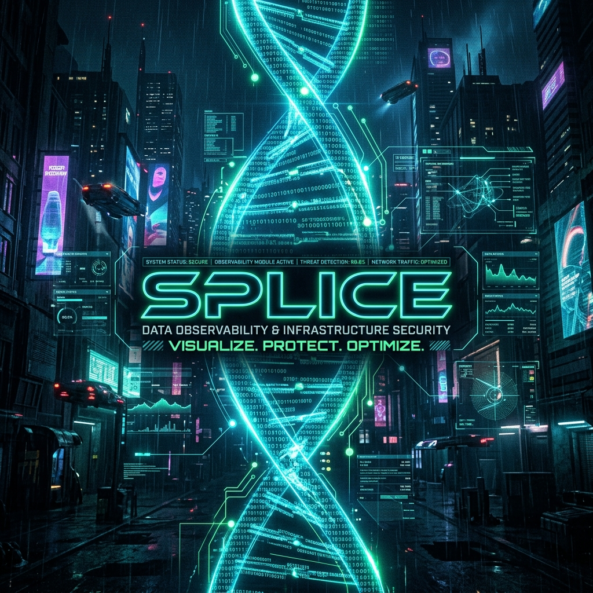
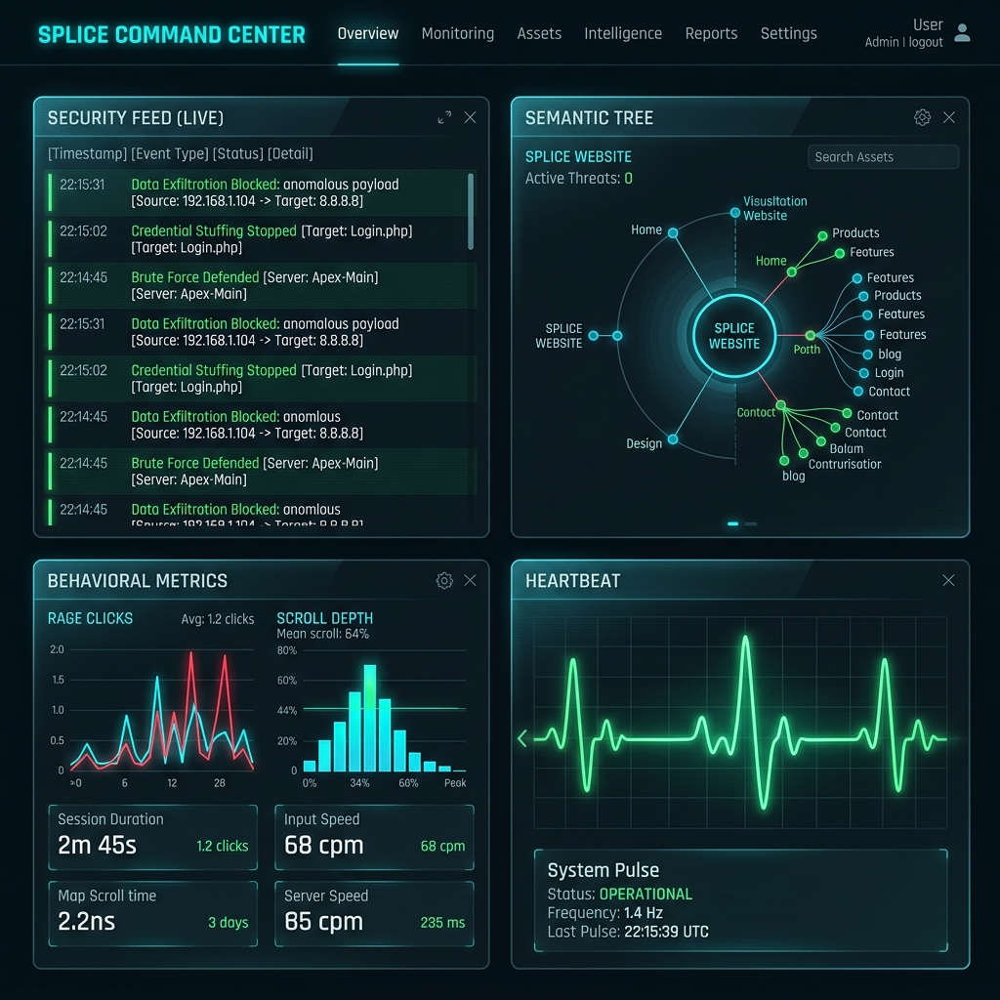

# Splice Enterprise 🧬



> **Built for Agents. Hardened for the Web. Observed for Excellence.**

Splice is an advanced, high-performance browser infrastructure and observability platform explicitly designed for **Autonomous Coding Agents** (like Claude Code, Cursor, and AutoGPT). It transforms chaotic, dynamic web interfaces into structured, safe, and highly-optimized data streams, ensuring agents can safely interact with the web without hallucinating or triggering security breaches.

---

## 🚀 Vision

In the era of "Vibe Coding," security and observability are often sidelined. Splice bridges this gap by providing a **God-Mode Observability** layer. It doesn't just browse; it audits, secures, and optimizes every byte of data before it reaches the agent's context window.

---

## ✨ Core Pillars

### 🛡️ Agentic Security Firewall (V5)
*   **Prompt Injection Shield**: Proactively redacts prompt injection attempts hidden in the DOM.
*   **Exfiltration Firewall**: Blocks exfiltration of local secrets and API keys to unverified domains.
*   **ACE Prevention**: Prevents Arbitrary Code Execution (ACE) before it reaches the agent's LLM context.

### 👁️ Deep Behavioral Telemetry (V4)
*   **Sentinel Engine**: Intercepts scrolling, element visibility, and form abandonment.
*   **Friction Detection**: Tracks rage clicks and navigation dead-ends to feed actionable product intelligence back to the agent.

### 🧠 Semantic Extraction Engine
*   **Token Optimization**: Translates complex DOM structures into a JSON "Semantic Tree," saving up to 80% of context window tokens.
*   **Self-Healing**: Uses heuristics to find and click the element the agent *intended* to click, even if attributes change.

---

## 📺 Cinematic Command Center

The Splice Command Center provides real-time visualization of agent activities and security interventions.



---

## 🛠️ Installation

Get Splice running in seconds:

```bash
# Clone the repository
git clone https://github.com/Arnavnemade1/Splice.git
cd Splice

# Install dependencies
npm install

# Build the project
npm run build
```

---

## 🚦 Quick Start

### Launch the MCP Server
Splice operates as a Model Context Protocol (MCP) server, making it compatible with any modern agent environment.
```bash
node dist/index.js
```

### Start Interactive Demo
Launch the observability engine and see the firewall in action:
```bash
# This will automatically open the Command Center in your browser
npx tsx demo.ts
```

---

## 🏗️ Architecture

Splice is built on top of **Playwright**, operating in a highly speculative browser environment. 
- **Vault**: Data persistence managed securely using `AES-256-GCM` encryption.
- **Sentinel**: Real-time event bus for behavioral tracking.
- **Firewall**: Interceptor-level egress filtering.

---

## 📜 License

MIT License. See [LICENSE](LICENSE) for details.

---

<p align="center">
  Developed with ❤️ for the future of Autonomous Agents.
</p>
