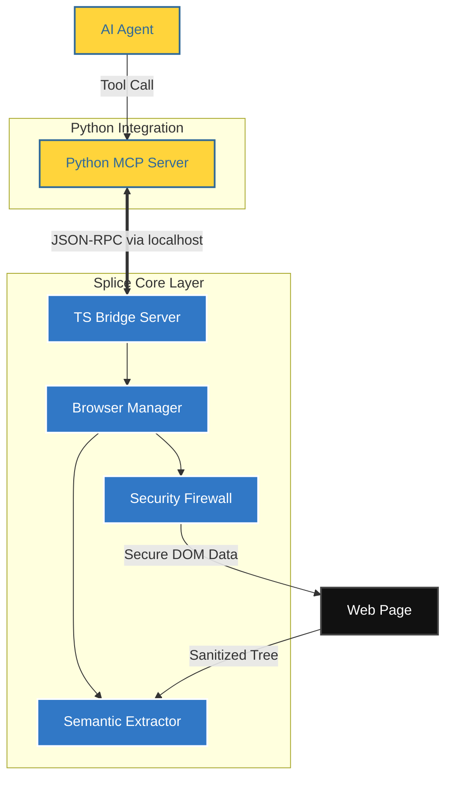

<div align="center">

# Splice Enterprise 

**The Operating System for Autonomous Web Agents**

[](https://github.com/Arnavnemade1/Splice/actions)
[](https://opensource.org/licenses/MIT)
[](https://www.typescriptlang.org/)
[](https://www.python.org/)
[](https://playwright.dev/)

<br />

Splice is an industry-standard browser infrastructure and observability platform purpose-built for AI Agents (Claude Code, Cursor, AutoGPT). It acts as a high-fidelity, secure filter between the raw web and your agent's context window.

[**Documentation**](#quick-start) • [**Architecture**](#architecture) • [**Security**](#security-model)

</div>

---

## ✦ Overview

While traditional browser automation tools (like Selenium or standard Playwright) are built for deterministic human testing, Splice is architected from the ground up to solve the unique challenges of non-deterministic, agentic web interaction. 

We solve three core problems for AI Agents:
1. **Security:** Preventing Prompt Injections and Arbitrary Code Execution hidden in the DOM.
2. **Context Limits:** Compressing massive HTML trees into dense, token-efficient Semantic JSON.
3. **Observability:** Providing humans with a God-Mode dashboard to monitor what the agent is actually doing.

> *"The difference between an agent that hallucinates and one that executes is the quality of its observability."*

---

## ✦ Core Capabilities

### Agentic Security Firewall (V5)
* **Prompt Injection Redaction:** Real-time detection and sanitization of malicious instructions hidden in DOM nodes.
* **Egress Firewall:** Intercepts and blocks unauthorized data exfiltration (e.g., API keys, local secrets) to unverified third-party domains.
* **ACE Hardening:** Prevents Arbitrary Code Execution patterns by auditing code blocks before they are processed by the agent.

### Semantic Extraction Engine
* **Token Optimization:** Compresses complex DOM structures into high-density "Semantic Trees," reducing token consumption by up to 85%.
* **Self-Healing Logic:** Heuristic-based element re-identification to prevent interaction failures on dynamic SPAs.

### Sentinel Behavioral Telemetry
* **Full-Spectrum Tracking:** Captures rage clicks, scroll depths, element visibility durations, and form abandonment.
* **Actionable Intelligence:** Feeds real-world user behavioral data back to the agent for data-driven iterations.

---

## ✦ Architecture

Splice utilizes a multi-layered proxy-less architecture to ensure zero latency and maximum reliability. We use a **Hybrid Bridge** model, allowing high-performance DOM manipulation in TypeScript while exposing a native Python SDK for the AI ecosystem.



---

## ✦ Installation & Quick Start

Splice is designed to operate seamlessly within your existing Agent Framework via the **Model Context Protocol (MCP)**. We offer both a high-performance Node.js core and a Python SDK.

### Option A: Python SDK (Recommended for LangChain / AutoGPT)

Perfect for data science workflows and native AI agent frameworks. This will automatically spawn the underlying TypeScript engine.

```bash
git clone https://github.com/Arnavnemade1/Splice.git
cd Splice

# Install the Node.js core dependencies
npm install
npm run build

# Install the Python SDK
cd python
pip install -e .

# Launch the Python MCP Server
splice-mcp
```

### Option B: Node.js Core (High Performance)

Ideal for environments that require maximum concurrency and direct Playwright integration.

```bash
git clone https://github.com/Arnavnemade1/Splice.git
cd Splice
npm install
npm run build

# Launch the TS MCP Server
node dist/index.js
```

### Interactive Command Center Demo
Experience the Sentinel engine and Firewall in real-time. This command automatically launches the cinematic Splice Command Center in your browser.
```bash
npx tsx demo.ts
```

---

## ✦ Security Model

Splice adheres to the **Zero-Trust Browser** principle:
- **Encryption**: All session metadata is encrypted using `AES-256-GCM`.
- **Isolation**: Each agent session runs in a hardened, isolated browser context.
- **Redaction**: Secrets are never exposed to the agent unless explicitly whitelisted by the developer.

---

## ✦ Roadmap
- [ ] **V6: LLM-Native Vision** - Multi-modal screenshot analysis for complex canvas interactions.
- [ ] **Data Science Executor** - Run sandboxed Python Pandas scripts directly on extracted DOM tables.
- [ ] **Cloud-Native Deployment** - Dockerized Splice clusters for enterprise-scale browser automation.

---

## ✦ Contributing
Splice is an open-core project. We welcome contributions from the community. Please see our [CONTRIBUTING.md](CONTRIBUTING.md) for details on our coding standards and PR process.

## ✦ License
Splice is released under the **MIT License**. See [LICENSE](LICENSE) for the full text.

<br />
<div align="center">
  <b>Built for the future of Autonomous Intelligence.</b><br>
  <sub>Maintained by Splice Enterprise & Contributors.</sub>
</div>
