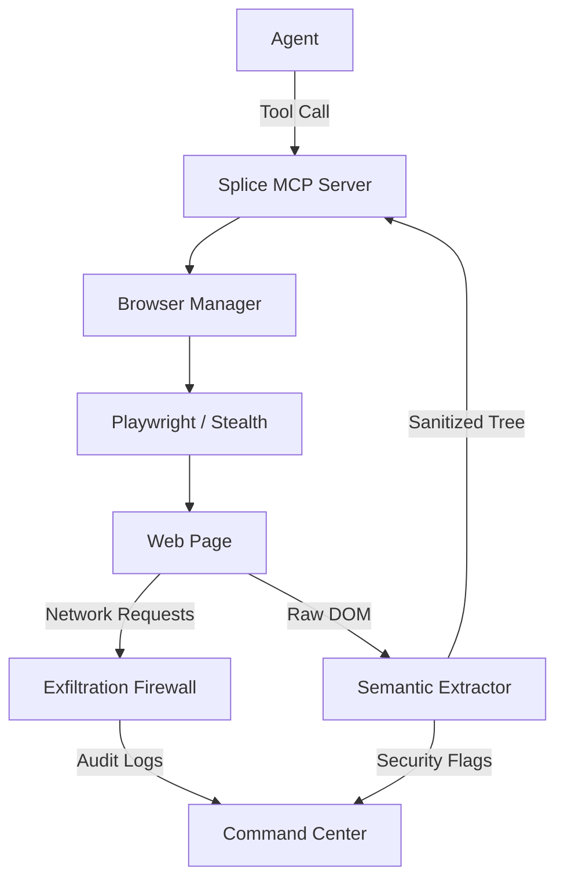

# Splice

<p align="center">
  <a href="https://github.com/Arnavnemade1/Splice/actions"></a>
  <a href="https://opensource.org/licenses/MIT"></a>
  <a href="https://www.typescriptlang.org/"></a>
  <a href="https://playwright.dev/"></a>
</p>

---

## Table of Contents
- [Overview](#overview)
- [Key Features](#key-features)
- [Technical Architecture](#technical-architecture)
- [Installation](#installation)
- [Quick Start](#quick-start)
- [Security Model](#security-model)
- [Roadmap](#roadmap)
- [Contributing](#contributing)
- [License](#license)

---

## Overview

Splice is an industry-standard browser infrastructure and observability platform purpose-built for Autonomous AI Agents. 

While traditional browser tools are built for humans, Splice is architected from the ground up to solve the unique challenges of agentic web interaction: Security, Observability, and Semantic Efficiency. It acts as a high-fidelity filter between the raw, chaotic web and your agent's context window.

> "The difference between an agent that hallucinates and one that executes is the quality of its observability."

---

## Key Features

### Agentic Security Firewall (V5)
*   **Prompt Injection Redaction**: Real-time detection and sanitization of malicious instructions hidden in DOM nodes.
*   **Egress Firewall**: Intercepts and blocks unauthorized data exfiltration (e.g., API keys, secrets) to unverified third-party domains.
*   **ACE Hardening**: Prevents Arbitrary Code Execution patterns by auditing code blocks before they are processed by the agent.

### Sentinel Behavioral Telemetry
*   **Full-Spectrum Tracking**: Captures rage clicks, scroll depths, element visibility durations, and form abandonment.
*   **Actionable Intelligence**: Feeds real-world user behavioral data back to the agent for data-driven product iterations.

### Semantic Extraction Engine
*   **Token Optimization**: Compresses massive DOM structures into high-density "Semantic Trees," reducing token consumption by up to 85%.
*   **Self-Healing Logic**: Heuristic-based element re-identification to prevent interaction failures on dynamic SPAs.

---

## Technical Architecture

Splice utilizes a multi-layered proxy-less architecture to ensure zero latency and maximum reliability.



---

## Installation

### Prerequisites
- Node.js 18.x or higher
- NPM or PNPM

### Setup
```bash
# Clone the repository
git clone https://github.com/Arnavnemade1/Splice.git
cd Splice

# Install production and development dependencies
npm install

# Build the TypeScript distribution
npm run build
```

---

## Quick Start

### 1. Start the MCP Server
Splice operates as a Model Context Protocol (MCP) server. You can run the native Node.js version, or our **new Python MCP Server** (built for LangChain, AutoGPT, and CrewAI compatibility).

**Option A: Node.js (High Performance Core)**
```bash
node dist/index.js
```

**Option B: Python SDK (AI Agent Ecosystem)**
```bash
cd python
pip install -e .
python mcp_server.py
```

### 2. Launch Interactive Demo
Experience the Sentinel engine and Firewall in real-time.
```bash
# Automatically launches the cinematic dashboard
npx tsx demo.ts
```

---

## Security Model

Splice adheres to the Zero-Trust Browser principle:
- **Encryption**: All session metadata is encrypted using AES-256-GCM.
- **Isolation**: Each agent session runs in a hardened browser context.
- **Redaction**: Secrets are never exposed to the agent unless explicitly whitelisted.

---

## Roadmap
- [ ] **V6: LLM-Native Vision** - Multi-modal screenshot analysis for complex canvas interactions.
- [ ] **Real-time Collaboration** - Shared session control for human-agent pair programming.
- [ ] **Cloud-Native Deployment** - Dockerized Splice clusters for enterprise-scale browser automation.

---

## Contributing
Splice is an open-core project. We welcome contributions from the community. Please see our [CONTRIBUTING.md](CONTRIBUTING.md) for details on our coding standards and PR process.

---

## License
Splice is released under the **MIT License**. See [LICENSE](LICENSE) for the full text.

---

<p align="center">
  <br>
  <b>Built for AI Agents </b><br>
  <sub>Maintained by Splice devs & Contributors.</sub>
</p>
