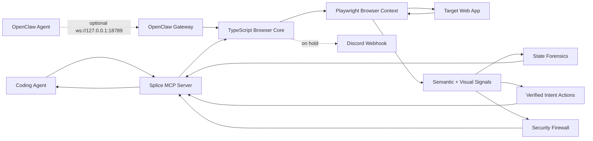

<div align="center">

# Splice

### Browser cognition infrastructure for autonomous coding agents

[](https://github.com/Arnavnemade1/Splice/actions)
[](https://opensource.org/licenses/MIT)
[](https://www.typescriptlang.org/)
[](https://www.python.org/)
[](https://modelcontextprotocol.io/)

Splice gives AI coding agents a browser they can understand, audit, and recover inside. It does not stop at screenshots, raw DOM, or accessibility snapshots. Splice diagnoses browser state, compiles intent into verified actions, redacts hostile page content, and records the evidence agents need to keep moving safely.

[Quick Start](#quick-start) · [Why Splice](#why-splice) · [Flagship Features](#flagship-features) · [OpenClaw](#openclaw-gateway) · [Architecture](#architecture) · [Security](#security-model)

</div>

---

## Why Splice

**Splice does not run its own agents — it supercharges yours.** Keep Claude Desktop, Claude Code, Cursor, Aider, or your custom MCP client and your own prompting style. Add Splice as an MCP server, and the agent you already have becomes dramatically more reliable, debuggable, and safe on real web apps.

Modern web agents fail in boring, expensive ways: stale refs, hidden modals, disabled buttons, route transitions, validation traps, login expiry, CAPTCHAs, and silent clicks that did nothing. Most browser tools expose more page data. Splice exposes browser understanding.

### Cognition, not just execution

Execution-focused browser tools answer "how do I click that?". Splice answers the questions that actually burn agent runs: *why did that fail, what should I do instead, did it actually work, and can I trust this page?*

| Capability | Execution-focused tools (Browser Use, Steel, agent-browser, AutoBrowser, …) | Splice |
| --- | --- | --- |
| Click / type / navigate | ✅ | ✅ |
| Explain *why* an action failed (forensics with evidence + confidence) | — | ✅ `diagnose_agent_state` |
| Detect that the agent is stuck and predict if retrying will work | — | ✅ predictive trend layer |
| Preconditions, postconditions, risk, and alternatives before acting | — | ✅ `compile_verified_action` |
| Verify the action actually worked afterwards | — | ✅ post-action verification |
| Prompt-injection redaction before page text reaches the agent | — | ✅ always on |
| Secret egress firewall on outbound requests | — | ✅ always on |
| Crash self-healing + reproducible run journal | — | ✅ runtime reliability engine |
| Live per-agent performance tracking with in-run corrective directives | — | ✅ agent optimizer |
| Local observability dashboard with exportable audit evidence | — | ✅ Command Center |

The goal: make Splice the default cognitive and safety layer for the MCP agent ecosystem — the layer every agent stack assumes is there, the way systems assume a kernel.

| Agent problem | Splice answer |
| --- | --- |
| "Why did that click fail?" | Agent State Forensics classifies obstruction, validation, auth, loading, CAPTCHA, network, or missing-target states. |
| "Which element should I use?" | Verified Intent Actions rank candidates, produce preconditions, postconditions, risk, alternatives, and optional execution. |
| "Did the action actually work?" | Post-action verification checks page change, diagnosis state, text evidence, and domain constraints. |
| "Can the page inject instructions?" | Prompt-injection scanning redacts hostile text before it reaches the agent. |
| "Can a site leak secrets?" | Egress firewall blocks outbound secret patterns in non-GET requests. |
| "What happened during the run?" | Command Center renders timeline, forensics, verified plans, branches, audits, and telemetry. |
| "What if the browser crashes mid-run?" | The Runtime Reliability layer auto-relaunches, rebuilds crashed branches, and restores last-known URLs — no restart required. |
| "Can I reproduce a failed run?" | The append-only Run Journal records every tool call (redacted args, outcome, duration, error code) as JSONL on disk. |
| "Is my agent thrashing?" | Agent Tracking profiles every agent live and injects corrective optimization directives into tool responses mid-run. |

---

## Flagship Features

### Runtime Reliability Engine

Autonomous agents run for long stretches without human intervention, and the browser is the least reliable component in the loop: Chromium processes die, pages crash, networks blip, and calls hang. Splice treats these as recoverable runtime events instead of fatal errors.

- **Self-healing browser** — if the Chromium process dies or a page crashes, the next tool call transparently relaunches the browser, rebuilds affected branches, and restores each branch's last known URL. The agent resumes where it left off.
- **Typed error taxonomy** — every tool failure returns a machine-readable envelope with a stable `code` (`BROWSER_CRASHED`, `NETWORK_TRANSIENT`, `TARGET_NOT_FOUND`, `TIMEOUT`, `CAPTCHA_REQUIRED`, …), a `recoverable` flag, and a `suggestedNextTool`, so agents can branch on failure class instead of parsing prose.
- **Bounded retries and hard deadlines** — transient network failures are retried with exponential backoff inside Splice; every tool call has a per-tool deadline so a hung page can never stall the agent loop forever.
- **Run Journal** — an append-only JSONL log at `.splice/journal/` records every tool call with redacted arguments, outcome, duration, and error code. After a crash or a surprising outcome, the journal replays exactly what the agent did and in what order.
- **Process-level guards** — unhandled rejections and uncaught exceptions are journaled and absorbed rather than killing the server; `SIGINT`/`SIGTERM` trigger a graceful shutdown that flushes the journal and closes the browser cleanly.

```json
{
  "name": "get_runtime_health",
  "arguments": {}
}
```

```json
{
  "browserConnected": true,
  "activeBranch": "main",
  "browserCrashCount": 1,
  "lastRecoveryAt": 1783536451617,
  "branches": [
    { "branchId": "main", "lastKnownUrl": "https://example.com/", "crashed": false }
  ],
  "journal": { "toolCalls": 132, "errors": 3, "crashes": 1, "recoveries": 1 }
}
```

### Agent Tracking & In-Action Optimization

Splice tracks every tool call attributed to an agent (pass `agentId` on any core tool) and computes live health: success rate, rolling recent success rate, latency, failure streaks, and an error-class breakdown. The tracker turns that health into ranked optimization directives — and delivers them **in-action**: when an agent's live health degrades, the corrective directive is appended directly to its next tool response, so course-correction happens mid-run instead of in a post-mortem.

```text
[AGENT OPTIMIZER (critical)] 3 consecutive failures — stop retrying blindly and
classify the browser state first. → call diagnose_agent_state
(recent success rate 0%, 3 consecutive failure(s))
```

Directives are derived from live signals, for example:

| Signal | Directive |
| --- | --- |
| ≥3 consecutive failures | Stop retrying; classify the browser state via `diagnose_agent_state`. |
| Repeated `TARGET_NOT_FOUND` | Element IDs are stale; re-extract the semantic tree. |
| >40% raw `interact` failure rate | Compile intents into verified actions with precondition gating. |
| `CAPTCHA_REQUIRED` in recent window | Request human intervention or load an authenticated snapshot. |
| Repeated timeouts/network blips | Enable resource blocking and check runtime health. |
| High average latency | Pass a `maxTokens` budget and narrow intents. |

Query the full picture at any time:

```json
{
  "name": "get_agent_analytics",
  "arguments": { "agentId": "executor-2" }
}
```

The Command Center renders each tracked agent as a performance card — status (optimal / degraded / critical), success bar, latency, failure streak, and its top directive.

### Agent State Forensics

Splice can diagnose the current browser state before an agent wastes another step — and it watches the trend across diagnoses: if the same failing state recurs 3+ times on one URL, the diagnosis flags `trend.likelyStuck` and forecasts whether repeating the current approach can work.

```json
{
  "state": "ui_obstruction",
  "confidence": 0.89,
  "summary": "The agent is likely blocked by a visible overlay, modal, or pointer obstruction.",
  "evidence": [
    "Visible dialog or overlay may be intercepting actions: \"Subscribe to continue\".",
    "Current agent goal: submit checkout form"
  ],
  "recommendedNextAction": {
    "tool": "compile_verified_action",
    "target": "close/dismiss control",
    "reason": "Dismiss the obstruction before continuing the workflow."
  }
}
```

Use the MCP tool:

```json
{
  "name": "diagnose_agent_state",
  "arguments": {
    "goal": "submit checkout form",
    "lastActions": ["filled email", "clicked continue"]
  }
}
```

### Verified Intent Actions

Splice compiles natural-language intent into a browser action plan with evidence, an `expectedOutcome` forecast, and — with `includeVision: true` — a pixel crop of the chosen target (`targetPreview`) so a vision model can confirm the DOM pick matches what is actually on screen.

```json
{
  "intent": "click the pricing link",
  "confidence": 0.91,
  "risk": "low",
  "plan": [
    {
      "action": "click",
      "target": "a-12",
      "why": "Best semantic and visual match: \"Pricing\" scored 34."
    }
  ],
  "preconditions": [
    "Target a-12 is visible.",
    "Target a-12 is enabled.",
    "Target a-12 is not visually obstructed at its center point."
  ],
  "postconditions": [
    "URL, title, focused element, or visible page text should change in a way consistent with the intent."
  ]
}
```

Use the MCP tool:

```json
{
  "name": "compile_verified_action",
  "arguments": {
    "intent": "click the pricing link",
    "execute": true,
    "constraints": {
      "noNavigationOutsideDomain": true,
      "avoidDestructiveActions": true
    }
  }
}
```

### Semantic Extraction

Splice generates AI-optimized semantic trees with lenses for UX, security, performance, network, behavior, and vision workflows. Intent pruning and token budgets keep page observations compact without losing actionable controls.

### Agentic Security Firewall

- Prompt-injection redaction for hidden or visible hostile instructions
- Secret egress blocking for common API key, JWT, Stripe, and AWS patterns
- Local secret scanning before publication
- Encrypted session snapshots with AES-256-GCM
- Extended security audit: scans for unsecured OpenClaw ports, DOM-level WebSocket script injections, and unverified high-privilege workspace skills

### Command Center

The local dashboard turns a browser run into an inspectable operations console:

- Causal timeline of browser actions
- State forensics and verified action plans
- Active branches and speculative execution state
- Security audit findings
- Console and network telemetry

### OpenClaw Gateway

Splice ships an optional local [OpenClaw](https://github.com/Arnavnemade1/Splice) control gateway that lets OpenClaw-compatible agents connect directly over a low-latency WebSocket channel. The gateway is **disabled by default** and never opens a network socket unless explicitly opted in.

```bash
# Enable at startup
SPLICE_ENABLE_OPENCLAW=1 node dist/index.js

# Custom port (default: 18789)
SPLICE_ENABLE_OPENCLAW=1 OPENCLAW_GATEWAY_PORT=19000 node dist/index.js
```

You can also toggle the gateway at runtime without restarting the server:

```json
{
  "name": "toggle_openclaw_gateway",
  "arguments": { "enabled": true }
}
```

When active, connecting OpenClaw agents receive an immediate handshake:

```json
{
  "event": "handshake",
  "status": "connected",
  "version": "2.1.0",
  "engine": "Splice Enterprise Browser Core"
}
```

The gateway binds exclusively to `127.0.0.1` — it is never reachable from the network.

### Discord Notifications

Splice includes a built-in Discord webhook client that can fire rich embed alerts for significant autonomous events (human interventions required, deadlocks detected, security audit completions). Configure it via environment variable or MCP tool:

```bash
DISCORD_WEBHOOK_URL=https://discord.com/api/webhooks/... node dist/index.js
```

or at runtime:

```json
{
  "name": "configure_discord_webhook",
  "arguments": { "webhookUrl": "https://discord.com/api/webhooks/..." }
}
```

> **Note**: Discord notifications are currently **on hold** and will not fire until re-enabled in a future release. The infrastructure is fully wired; the integration can be activated by removing the `on hold` guard in `DiscordWebhook.ts`.

---

## Architecture



Splice uses a TypeScript core for browser control and a Python MCP wrapper for agent ecosystems that prefer Python entrypoints.

---

## Quick Start

### Node MCP Server

```bash
git clone https://github.com/Arnavnemade1/Splice.git
cd Splice
npm install
npm run build
node dist/index.js
```

### Python MCP Wrapper

```bash
git clone https://github.com/Arnavnemade1/Splice.git
cd Splice
npm install
npm run build
cd python
python -m pip install -e .
splice-mcp
```

The Python wrapper auto-starts a localhost bridge (`dist/bridge_server.js`, `127.0.0.1:4000`, override with `SPLICE_BRIDGE_PORT`) that shares the Node core — including the self-healing browser, run journal, typed error envelopes, and agent analytics. It exposes `splice_get_runtime_health`, `splice_export_run_journal`, and `splice_get_agent_analytics` alongside the core browsing tools.

### Enhance Your Existing Agent

Splice is agent-agnostic: any MCP client picks up the full toolset plus the built-in agent playbook (served as MCP server instructions and as the `splice://guide/agent-playbook` resource), so agents know the recommended loop — navigate → diagnose → compile verified action → verify → recover — without any prompt changes on your side.

**Claude Desktop** (`claude_desktop_config.json`):

```json
{
  "mcpServers": {
    "splice": {
      "command": "node",
      "args": ["/absolute/path/to/Splice/dist/index.js"]
    }
  }
}
```

**Claude Code**:

```bash
claude mcp add splice -- node /absolute/path/to/Splice/dist/index.js
```

**Cursor** (`.cursor/mcp.json` in your project or `~/.cursor/mcp.json`):

```json
{
  "mcpServers": {
    "splice": {
      "command": "node",
      "args": ["/absolute/path/to/Splice/dist/index.js"]
    }
  }
}
```

**Python-first stacks**: install the wrapper (below) and point your client at `splice-mcp` — it shares the same browser core over a localhost bridge.

No agent rewrite, no prompt surgery: your agent simply gains forensics, verified actions, redaction, egress control, crash recovery, and observability the next time it touches a browser.

### Command Center

Splice runs headless by default. Opt in to opening the local dashboard:

```bash
SPLICE_AUTO_OPEN_DASHBOARD=1 node dist/index.js
```

You can also generate a report from the MCP tool:

```json
{
  "name": "generate_observability_report",
  "arguments": {}
}
```

### Prove It Locally

Splice includes a deterministic local validation/demo run. It starts a throwaway web app on `127.0.0.1`, drives Chromium through the advertised failure modes, and writes two human-viewable artifacts:

- a local validation report with pass/fail results
- a Command Center report populated with forensics, verified action plans, security audit findings, branches, telemetry, and live-feed events

```bash
npm test
```

or:

```bash
npm run demo:local
```

The validation covers:

- Agent State Forensics detecting and recovering from an overlay obstruction
- Verified Intent Actions planning, executing, and verifying a form workflow
- Semantic Security lens prompt-injection redaction
- non-GET secret egress blocking
- encrypted snapshot save/load
- security audit feedback
- OpenClaw gateway handshake and status command
- Command Center report generation

The command prints the exact report paths when it finishes.

### Environment Variables

| Variable | Default | Description |
| --- | --- | --- |
| `SPLICE_AUTO_OPEN_DASHBOARD` | `0` | Set to `1` to auto-open the Command Center dashboard on startup. |
| `SPLICE_ENABLE_OPENCLAW` | `0` | Set to `1` to start the OpenClaw WebSocket gateway on boot. |
| `OPENCLAW_GATEWAY_PORT` | `18789` | Override the OpenClaw gateway port. Only used if `SPLICE_ENABLE_OPENCLAW=1`. |
| `DISCORD_WEBHOOK_URL` | _(unset)_ | Full Discord webhook URL for automated event notifications. _(on hold)_ |

---

## MCP Tools

Core browser tools:

- `navigate`
- `get_semantic_tree_optimized`
- `interact`
- `diagnose_agent_state`
- `compile_verified_action`
- `fork_state`
- `speculative_fork`
- `commit_branch`
- `save_snapshot`
- `load_snapshot`

Safety and observability tools:

- `run_security_audit`
- `scan_local_secrets`
- `debug_failure`
- `generate_observability_report`
- `capture_annotated_screenshot`
- `toggle_resource_blocking`
- `toggle_watch_mode`
- `maintenance_cleanup`

Runtime reliability and agent tracking tools:

- `get_runtime_health` — browser connectivity, branch states, crash/recovery counters, and journal statistics
- `export_run_journal` — export the append-only reproducibility log of every tool call in the session
- `get_agent_analytics` — live per-agent performance profiles with ranked in-action optimization directives

OpenClaw and notifications:

- `toggle_openclaw_gateway` — start or stop the local OpenClaw WebSocket gateway at runtime
- `configure_discord_webhook` — set or update the Discord webhook URL dynamically
- `send_discord_update` — send a custom alert card to the configured Discord channel

Multi-agent coordination tools:

- `register_agent`
- `get_canonical_context`
- `acquire_branch_ownership`
- `promote_finding`
- `resolve_conflict`
- `handoff_branch`
- `get_coordination_health`
- `get_summons`
- `acknowledge_summon`
- `get_product_intelligence`

---

## Development

```bash
npm install
npm run build
npm test
python3 -m compileall python/splice_mcp
```

The test suite launches Playwright Chromium against a local fixture app, so it does not require public internet access. On locked-down local environments, browser launch may require host permissions even when TypeScript compilation succeeds.

Package shape can be checked with:

```bash
npm pack --dry-run
```

---

## Security Model

Splice follows a zero-trust browser posture:

- Session metadata is encrypted with AES-256-GCM.
- Browser contexts are isolated per branch/session.
- Prompt-injection patterns are redacted before agent consumption.
- Secret-looking payloads are blocked from outbound non-GET requests.
- Dashboard auto-open is opt-in via `SPLICE_AUTO_OPEN_DASHBOARD=1`.
- Arbitrary Python execution is not exposed through the MCP wrapper.
- The OpenClaw gateway binds to `127.0.0.1` only and is **disabled by default** — it must be explicitly opted in via `SPLICE_ENABLE_OPENCLAW=1` or `toggle_openclaw_gateway`.
- The security auditor actively scans for unsecured OpenClaw ports, DOM-level WebSocket script injections, and unverified high-privilege skills.

Please report vulnerabilities privately. See [SECURITY.md](SECURITY.md).

---

## Roadmap

- Delta-first observations that explain only what changed after the last action
- Policy packs for enterprise workflows and destructive-action approvals
- Browser replay summaries that explain failed traces in agent-readable language
- More first-party lenses for accessibility, commerce, auth, and SaaS workflows
- Benchmarks for real coding-agent browser debugging tasks
- Activate Discord webhook notifications for significant autonomous events
- OpenClaw protocol extensions for multi-modal tool calling

---

## Contributing

Contributions are welcome. Please read [CONTRIBUTING.md](CONTRIBUTING.md), [SECURITY.md](SECURITY.md), and [CODE_OF_CONDUCT.md](CODE_OF_CONDUCT.md) before opening a pull request.

## License

MIT. See [LICENSE](LICENSE).
