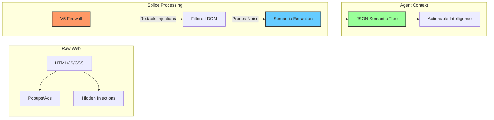
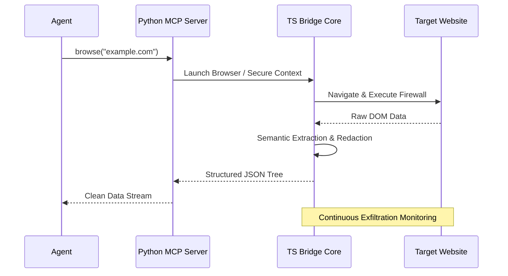

<div align="center">

# Splice

**The Operating System for Autonomous Web Agents**

[](https://github.com/Arnavnemade1/Splice/actions)
[](https://opensource.org/licenses/MIT)
[](https://www.typescriptlang.org/)
[](https://www.python.org/)
[](https://playwright.dev/)

<br />

Splice is an industry-standard browser infrastructure and observability platform purpose-built for AI Agents (Claude Code, Cursor, AutoGPT). It acts as a high-fidelity, secure filter between the raw web and your agent's context window.

[**Mission**](#the-mission) • [**Documentation**](#quick-start) • [**Architecture**](#architecture) • [**Security**](#security-model)

</div>

---

## The Mission

**Make the web safe and readable for AI.**

Today's internet is composed of complex code designed specifically for human interaction. AI agents often struggle to navigate this noise and are vulnerable to hidden security threats. 

Splice acts as a translation layer: it redacts threats, prunes unnecessary DOM noise, and provides agents with a structured, high-fidelity map of the environment. For AI to achieve true autonomy, it requires a browser environment designed for machines.

---

## Overview

While traditional browser automation tools are built for deterministic testing, Splice is architected to solve the unique challenges of non-deterministic, agentic web interaction. 

The platform addresses three core requirements:
1. **Security:** Blocking prompt injections and data theft hidden in websites.
2. **Efficiency:** Converting large web pages into token-efficient data structures.
3. **Visibility:** Providing real-time telemetry of agent actions.

---

## Data Transformation Flow

How Splice transforms an unstructured website into structured agent context:



---

## Core Capabilities

### Agentic Security Firewall (V5)
* **Prompt Injection Redaction:** Real-time detection and sanitization of malicious instructions hidden in DOM nodes.
* **Egress Firewall:** Intercepts and blocks unauthorized data exfiltration (e.g., API keys, local secrets) to unverified third-party domains.
* **ACE Hardening:** Prevents Arbitrary Code Execution patterns by auditing code blocks before they are processed by the agent.

### Semantic Extraction Engine
* **Token Optimization:** Compresses complex DOM structures into high-density "Semantic Trees," reducing token consumption by up to 85%.
* **Self-Healing Logic:** Heuristic-based element re-identification to prevent interaction failures on dynamic applications.

### Sentinel Behavioral Telemetry
* **Full-Spectrum Tracking:** Captures rage clicks, scroll depths, element visibility durations, and form abandonment.
* **Actionable Intelligence:** Feeds real-world user behavioral data back to the agent for data-driven iterations.

---

## Architecture

Splice utilizes a multi-layered proxy-less architecture. The system uses a Hybrid Bridge model, allowing high-performance DOM manipulation in TypeScript while exposing a native Python SDK for the AI ecosystem.



---

## Installation & Quick Start

Splice is designed to operate within your existing Agent Framework via the Model Context Protocol (MCP).

### Option A: Python SDK (Recommended)

```bash
git clone https://github.com/Arnavnemade1/Splice.git
cd Splice && npm install && npm run build
cd python && pip install -e .
splice-mcp
```

### Option B: Node.js Core

```bash
git clone https://github.com/Arnavnemade1/Splice.git
cd Splice && npm install && npm run build
node dist/index.js
```

### Interactive Command Center Demo
Launch the cinematic dashboard to see the firewall in action:
```bash
npx tsx demo.ts
```

---

## Security Model

Splice adheres to the Zero-Trust Browser principle:
- **Encryption**: All session metadata is encrypted using AES-256-GCM.
- **Isolation**: Each agent session runs in a hardened, isolated browser context.
- **Redaction**: Secrets are never exposed to the agent unless explicitly whitelisted.

---

## Roadmap
- [ ] **V6: LLM-Native Vision** - Multi-modal screenshot analysis.
- [ ] **Data Science Executor** - Run sandboxed Python scripts on extracted data.
- [ ] **Cloud-Native Deployment** - Dockerized Splice clusters.

---

## Contributing
Splice is an open-core project. We welcome contributions from the community. Please see our CONTRIBUTING.md for details on our coding standards and PR process.

## License
Splice is released under the MIT License. See LICENSE for the full text.

<br />
<div align="center">
  <b>Built for the future of Autonomous Intelligence.</b><br>
  <sub>Maintained by Splice & Contributors.</sub>
</div>
