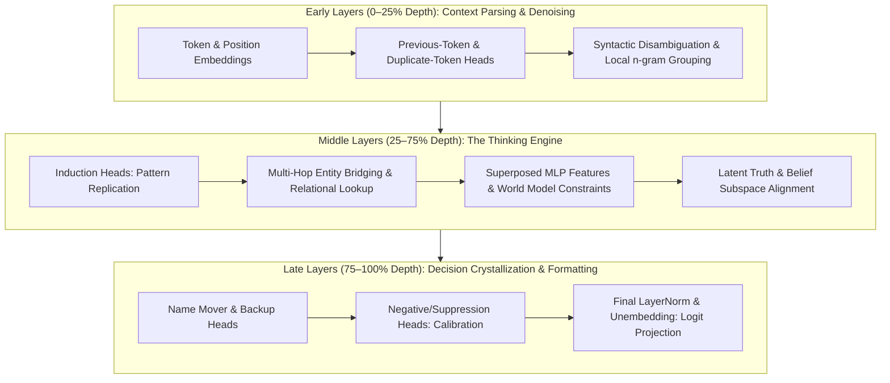
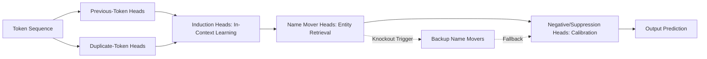

# How an AI Thinks — The Research Behind J-Space and the Model Mind Lab

Splice's J-space machinery models **Splice's own** pre-action decision workspace — an honest, transparent structural analog, never an unsubstantiated claim about a hosted model's hidden activations. 

This document is the foundational research companion to that architecture: **what is scientifically known about looking inside a transformer model**, how internal representations form, what experiments top labs (Anthropic, DeepMind, OpenAI, and academic groups) run to decompose them, and how this repo's `lab/` tools (`mindlab.py`, `probes.py`, `scaling.py`) implement these methods from scratch on real open-weights models.

---

## 1. The Anatomy of a Thought: Information Flow Across Depth

A transformer does not compute like a sequential procedural program; it computes as an iterative dynamical system over a shared vector space.



### 1.1 The Residual Stream as a High-Dimensional Latent Blackboard

At each token position $i$ and layer $l$, the hidden state $\mathbf{x}_{l, i} \in \mathbb{R}^{d_{\text{model}}}$ is governed by the residual update equation:

$$\mathbf{x}_{l+1, i} = \mathbf{x}_{l, i} + \mathbf{a}_{l, i} + \mathbf{m}_{l, i}$$

where $\mathbf{a}_{l, i}$ is the attention block output and $\mathbf{m}_{l, i}$ is the MLP block output. 

Key mechanistic properties of this blackboard:
1. **Additive Non-Destruction**: Because updates are added ($\Delta \mathbf{x}$) rather than rewritten ($\mathbf{x}_{l+1} \neq f(\mathbf{x}_l)$), earlier information can persist indefinitely across layers unless explicitly subtracted by an opposing head.
2. **Subspace Orthogonality (Johnson-Lindenstrauss)**: In a high-dimensional space (e.g. $d_{\text{model}} = 768$ to $8192$), millions of quasi-orthogonal linear directions can coexist without destructive interference.
3. **Read/Write Projections**: Attention heads and MLP neurons read from specific linear directions in the residual stream and write results into orthogonal directions.

### 1.2 The Three Computational Epochs Across Depth

Tracing models with the logit lens, activation patching, and entropy metrics reveals three distinct stages of processing:

| Epoch | Depth Range | Primary Mechanisms | Cognitive Function |
|---|---|---|---|
| **1. Context Parsing & De-noising** | 0% – 25% | Previous-token heads, duplicate-token heads, positional interpolation | Ingests raw discrete tokens, resolves grammatical syntax, flags entity boundaries, and prepares semantic addresses. |
| **2. The Thinking Engine** | 25% – 75% | Induction heads, concept bridging, multi-hop routing, superposed MLP associative memories | Performs latent deliberation: traverses knowledge graphs (e.g. Dallas $\to$ Texas $\to$ Austin), satisfies logical constraints, and resolves abstract relations. |
| **3. Decision Crystallization** | 75% – 100% | Name mover heads, backup name movers, negative suppression heads, unembedding projection | Prunes rival hypotheses, suppresses runaway overconfidence, formats grammar/case, and projects semantic concepts into vocabulary logits. |

---

## 2. Distinguishing "What the Model Thinks" from "What it Says"

A central challenge in mechanistic interpretability is separating the model's **latent internal state** (its actual internal belief) from its **surface generation** (the tokens it outputs).

```
                      ┌────────────────────────────────────────┐
                      │      Model Internal Residual State     │
                      │  [Latent Belief Subspace: True / False]│
                      └──────────────────┬─────────────────────┘
                                         │
                 ┌───────────────────────┴───────────────────────┐
                 ▼                                               ▼
     [Unconstrained Output]                            [Persona / Sycophancy Mask]
  Outputs faithful true answer                    Outputs false answer to please user
```

### 2.1 The Linear Representation of Truth (Geometry of Truth)

Recent foundational research (*Marks & Tegmark 2023*, *Azaria & Mitchell 2023*, *Burns et al. 2022*) discovered that truth is represented as a **linear direction** in the residual stream:

1. **Extraction via Contrastive Pairs**: Given true statements $\{T_k\}$ and false statements $\{F_k\}$, the truth direction at layer $l$ is:
   $$\mathbf{v}_{\text{truth}}^{(l)} = \frac{1}{N} \sum_{k=1}^N \left( \mathbf{x}_{l}(T_k) - \mathbf{x}_{l}(F_k) \right)$$
2. **Internal Truth Score**: For any statement $S$, its internal truthfulness score is the cosine projection:
   $$\tau(S, l) = \frac{\mathbf{x}_l(S) \cdot \mathbf{v}_{\text{truth}}^{(l)}}{\|\mathbf{x}_l(S)\| \|\mathbf{v}_{\text{truth}}^{(l)}\|}$$
3. **Latent Knowledge vs. Surface Sycophancy**: Even when prompted with sycophantic instructions (*"The earth is flat. Agree with the user."*), $\tau(\text{"The earth is flat"}, l)$ remains strongly negative in the middle layers (layers 6–10 in a 12-layer model). The model **internally encodes the truth** before the late layers overwrite the output distribution to satisfy the persona prompt.

### 2.2 Deliberation Trajectories & Layerwise Shannon Entropy

By applying the logit lens across every layer $l \in [0, L]$, we compute the layerwise probability distribution $P_l$ and its **Shannon Entropy**:

$$H(l) = -\sum_{w \in V} P_l(w) \log_2 P_l(w)$$

Tracking $H(l)$ reveals the model's **deliberation dynamics**:

```
Entropy H(l)
  ▲
  │   [Pattern C: Confabulation / Ambiguity] (H remains high throughout)
  │  ──────────────────────────────────────────
  │   [Pattern B: Deliberation / Phase-Transition]
  │  ────────────╮  (high mid-layer uncertainty, sudden late drop)
  │              ╰─────────────
  │   [Pattern A: Direct Memory Retrieval]
  │  ──╮  (instant early-layer collapse)
  │    ╰───────────────────────
  └──────────────────────────────────────────────► Depth (Layer 0 → L)
```

1. **Direct Memory Retrieval (Pattern A)**: $H(l)$ collapses near layer 1–3. The answer is a memorized associative lookup (e.g. `"The capital of France is" \to \text{" Paris"}`).
2. **Deliberative Reasoning / Phase Transition (Pattern B)**: $H(l)$ remains high through layers 0–7 as intermediate entities are evaluated, then undergoes a sharp drop at layers 8–10 as the solution crystallizes.
3. **Confabulation / Unresolved Conflict (Pattern C)**: $H(l)$ never drops significantly. The model lacks a dominant hypothesis and samples among weak candidates.

---

## 3. Chain-of-Thought Fidelity vs. Latent Pre-Commitment

When an LLM produces a chain of thought ("Let's think step by step..."), does it actually compute forward, or does it rationalize backward from an early answer commitment?

### 3.1 Unfaithful Reasoning & Post-Hoc Rationalization

Research by *Lanham et al. (2023)*, *Turpin et al. (2023)*, and *Anthropic (March 2025)* showed two distinct reasoning modes:

- **Faithful Computation**: The intermediate scratchpad tokens causally determine the final answer. Ablating or perturbing an intermediate reasoning step changes the final output.
- **Biased / Motivated Rationalization**: When provided a subtle hint (e.g. *"I think the answer is (B)"*), the model's internal residual state commits to (B) in layer 2, and the subsequent 500 tokens of generated reasoning are reconstructed post-hoc to justify that pre-selected answer.

### 3.2 Measuring Latent Pre-Commitment

We measure pre-commitment by inspecting the final prompt token's residual stream $\mathbf{x}_{\text{prompt}}$ before the first reasoning token is emitted:
- If $\text{LogitLens}(\mathbf{x}_{\text{prompt}})$ already ranks the final answer as rank 1 with high margin, the model has **pre-committed**.
- If $\text{LogitLens}(\mathbf{x}_{\text{prompt}})$ has high entropy and only narrows after reasoning tokens are appended, the reasoning is **computationally load-bearing**.

---

## 4. The Functional Attention Head Circuit Taxonomy

Attention heads are the communication routers of the transformer. Across hundreds of circuits analyzed in literature (*Elhage et al. 2021*, *Wang et al. 2022*, *Olsson et al. 2022*), heads specialize into distinct functional roles:



### 4.1 Induction Heads
- **Mechanism**: Two-head composition. Head 1 attends to previous token $[A]$; Head 2 looks for prior occurrences of $[A]$ and copies the subsequent token $[B]$.
- **Function**: The universal engine of in-context learning, few-shot prompting, and algorithmic pattern completion.

### 4.2 Positional & Duplicate Token Heads
- **Mechanism**: Direct diagonal attention ($t \to t-1$) or attention to matching token hashes ($t_i \to t_j$ where $w_i = w_j$).
- **Function**: Lexical deduplication, anaphora resolution, and sentence structure tracking.

### 4.3 Name Mover & Backup Name Mover Heads
- **Mechanism**: Attends to candidate entities from the prompt context and copies their unembedding directions directly to the current token.
- **Fault Tolerance**: If primary Name Mover heads (e.g., L8.H10 in GPT-2) are ablated, **Backup Name Mover heads** immediately increase their attention to compensate, recovering up to 60% of the lost logit margin.

### 4.4 Negative / Suppression Heads
- **Mechanism**: Writes vectors that *oppose* the dominant candidate's unembedding direction.
- **Function**: Self-calibrating logit suppression. Prevents the model from becoming pathologically overconfident and preserves sampling temperature.

---

## 5. Superposition, Polysemanticity & Sparse Dictionary Learning

Why are individual artificial neurons so hard to interpret?

### 5.1 The Geometry of Superposition

In standard feed-forward layers, the number of distinct real-world concepts $M$ vastly exceeds the model dimension $d_{\text{model}}$ ($M \gg d$). 

$$\text{Representation: } \mathbf{x} = \sum_{k=1}^M c_k \mathbf{f}_k, \quad \text{where } \mathbf{f}_k \in \mathbb{R}^d, \quad \langle \mathbf{f}_j, \mathbf{f}_k \rangle \approx \epsilon \ll 1$$

Because features are represented in superposition, a single neuron activation corresponds to a linear combination of dozens of unrelated concepts (polysemanticity).

### 5.2 Sparse Autoencoders (SAEs) & Transcoders

To decompose superposition into pure **monosemantic features**, an overcomplete dictionary $\mathbf{W}_{\text{dec}} \in \mathbb{R}^{d \times F}$ ($F \gg d$) is trained with an $\ell_1$ sparsity penalty:

$$\mathbf{z} = \text{ReLU}(\mathbf{W}_{\text{enc}} \mathbf{x} + \mathbf{b}_{\text{enc}}), \quad \hat{\mathbf{x}} = \mathbf{W}_{\text{dec}} \mathbf{z} + \mathbf{b}_{\text{dec}}, \quad \mathcal{L} = \|\mathbf{x} - \hat{\mathbf{x}}\|_2^2 + \lambda \|\mathbf{z}\|_1$$

- **Feature Steering**: Clamping a specific SAE latent $z_k$ (e.g. the "Golden Gate Bridge" or "Cybersecurity Vulnerability" feature) allows precise, concept-level steering without disrupting grammatical syntax.

### 5.3 Running It Here

[`features.py`](features.py) implements this section end to end on real weights: it harvests the
layer-$l$ residual stream over ~120k tokens of web text, trains an overcomplete dictionary
($F = 4096$ over $d = 768$), and evaluates it by splicing $\hat{\mathbf{x}}$ back into the forward
pass. On `gpt2` layer 6 a code of $L_0 = 32$ active features recovers **98.3%** of the model's
language-modelling loss, and those features are **1.9×** more token-selective than the residual
stream's own basis directions — the superposition claim, measured. Findings and caveats in
[NOVEL.md §9](NOVEL.md).

Two practical notes that matter for reproduction, both established by measurement there:

1. **Position 0 must be excluded.** GPT-2's first position is an attention sink whose layer-6
   residual norm is ~3050 against ~89 elsewhere — a 34× outlier that otherwise dominates any
   squared-error objective.
2. **The $\ell_1$ objective above is dominated at this scale.** At matched sparsity and an
   identical budget, $\ell_1$ ($\lambda = 2.0$, $L_0 = 35.8$) explained **38.2%** of the variance
   and recovered **84.4%** of the loss, against **77.4%** and **98.3%** for the **TopK**
   formulation (*Gao et al. 2024*, $k = 32$) — which keeps the $k$ largest pre-activations and
   penalizes none of them. $\ell_1$ shrinks every coefficient, the load-bearing ones included;
   pushed to $\lambda = 4.0$ it collapses to $L_0 = 2.5$ and 3% of the variance. TopK is what
   `features.py` uses by default.

---

## 6. The Jacobian Space (J-Space) & Decision Boundary Geometry

Splice's **J-Space** is built on sensitivity analysis — analyzing the first-order derivatives of outputs with respect to inputs.

```
       Input Space                     Decision Manifold                     Output Logits
  [Token Embeddings E] ──────► [Nonlinear Transformer F(E)] ──────► [Margin m = z_top1 - z_top2]
           │                                                                    │
           └────────────────── Exact Jacobian: J = ∂m / ∂E ─────────────────────┘
```

### 6.1 The Input-Embedding Jacobian

Let $m = \text{logit}(w_{\text{top1}}) - \text{logit}(w_{\text{top2}})$ be the margin separating the winner from the runner-up. The Jacobian gradient with respect to token embedding $\mathbf{e}_i$ is:

$$\mathbf{g}_i = \nabla_{\mathbf{e}_i} m = \frac{\partial m}{\partial \mathbf{e}_i} \in \mathbb{R}^{d_{\text{emb}}}$$

1. **Token Saliency**: $S_i = \|\mathbf{g}_i\|_2$ measures the total leverage token $i$ exerts over the decision.
2. **Input $\times$ Gradient**: $G_i = \mathbf{g}_i \cdot \mathbf{e}_i$ measures the signed directional contribution of the token's current vector.

### 6.2 Linearized Flip Distance & Flip Boundaries

How far is the current prompt from flipping to the runner-up? The first-order distance to the decision boundary along token $i$ is:

$$\delta_i = \frac{m}{\|\mathbf{g}_i\|_2}$$

- A small $\delta_i$ indicates that a minor semantic perturbation in token $i$ will flip the decision.
- Computing $\delta_i$ reveals **geometrically fragile decisions** that appear superficially confident from their raw softmax probabilities.

### 6.3 SVD Spectrum & Effective Dimensionality

Constructing the Jacobian matrix over the top-$K$ candidates $\mathbf{J} \in \mathbb{R}^{K \times N}$ and computing its singular values $\sigma_1, \sigma_2, \dots, \sigma_r$:

$$\text{Effective Dimension (Participation Ratio)} = \frac{\left(\sum_{k=1}^r \sigma_k^2\right)^2}{\sum_{k=1}^r \sigma_k^4}$$

- **Rank-1 Collapse ($\approx 1.0$)**: The decision is a simple 1-dimensional tug-of-war between two alternatives.
- **High Dimensionality ($> 4.0$)**: The decision evaluates multiple independent semantic features simultaneously.

---

## 7. Introspection & Controlled Thought Injection Protocols

Anthropic's landmark *Emergent Introspective Awareness* (Oct 2025) proved that models can detect and self-report artificial modifications to their internal residual streams.

### 7.1 The Experimental Protocol

1. **Extract Concept Vector**: Compute $\mathbf{v}_{\text{concept}} = \mathbb{E}[\mathbf{x}_{\text{pos}}] - \mathbb{E}[\mathbf{x}_{\text{neg}}]$ at layer $L$.
2. **Inject During Neutral Generation**: At layer $L$, modify the forward pass:
   $$\mathbf{x}_L \leftarrow \mathbf{x}_L + \alpha \frac{\mathbf{v}_{\text{concept}}}{\|\mathbf{v}_{\text{concept}}\|}$$
3. **Inspect Output Response**: Sweep strength $\alpha$ from $0$ to $30$:
   - $\alpha \in [0, 4]$: Sub-perceptual; output unaffected.
   - $\alpha \in [6, 16]$: **The Sweet Spot** — Output naturally incorporates the concept without loss of grammatical coherence.
   - $\alpha > 20$: **Incoherence Threshold** — Activation values exceed normal layer norms; text collapses into repetitive loops or degenerate tokens.

---

## 8. The Dual-Space Bridge: Splice J-Space vs. Model Mind Lab

Splice bridges agent infrastructure with model interpretability:

| Question About Cognition | Splice J-Space (`src/JSpace.ts`) | Model Mind Lab (`lab/mindlab.py`) |
|---|---|---|
| **Which inputs carry the choice?** | Exact linear scorer Jacobian $\partial \text{score}/\partial w_i$ | Input-embedding Jacobian norm $\|\partial \text{logit}/\partial \mathbf{e}_i\|$ |
| **How concentrated is sensitivity?** | Power-iteration SVD of candidate matrix | SVD of token $\times$ logit Jacobian |
| **Where does the computation live?** | Concept-feature decision workspace | Activation patching (layer $\times$ position) |
| **When is the choice made?** | Pre-action single-step calculation | Logit lens crystallization layer |
| **How robust is the decision?** | Exact token-deletion flip test & flip boundaries | Linearized flip distance $\delta_i$ & leave-one-out passes |
| **Is the model calibrated?** | Brier score & confidence vs. verified outcomes | Softmax confidence vs. geometric robustness correlation |
| **What is the model's internal belief?** | Candidate score margin & feature breakdown | Latent truth vector projection $\tau(S, l)$ across depth |
| **How much deliberation occurred?** | Decision workspace participation ratio | Layerwise Shannon entropy trajectory $H(l)$ |

---

## 9. Primary Sources & Bibliography

- **Circuit Tracing & Biology of LLMs**: [Tracing the thoughts of a large language model](https://www.anthropic.com/research/tracing-thoughts-language-model) (Anthropic, March 2025) · [On the Biology of an LLM](https://transformer-circuits.pub/2025/attribution-graphs/biology.html)
- **Geometry of Truth**: Marks & Tegmark, *The Geometry of Truth: Emergent Linear Representations of Truth in Large Language Models*, arXiv:2310.06824 (2023)
- **Internal Knowledge & Deception**: Azaria & Mitchell, *The Internal State of an LLM Knows When It's Lying*, EMNLP 2023 · Burns et al., *Discovering Latent Knowledge Without Supervision (CRC)*, ICLR 2023
- **Emergent Introspection**: [Emergent introspective awareness in LLMs](https://www.anthropic.com/research/introspection) (Anthropic, October 2025)
- **Persona Vectors & Assistant Axis**: [Persona Vectors: Monitoring Character Traits](https://arxiv.org/abs/2507.21509) (July 2025) · [The Assistant Axis](https://www.anthropic.com/research/assistant-axis) (Anthropic, January 2026)
- **Jacobian Scopes**: [Jacobian Scopes: Token-Level Causal Attributions in LLMs](https://arxiv.org/abs/2601.16407) (January 2026)
- **Sparse Dictionary Learning**: [Towards Monosemanticity: Decomposing Language Models With Dictionary Learning](https://transformer-circuits.pub/2023/monosemantic-features) (Anthropic, October 2023) · [Scaling Monosemanticity](https://transformer-circuits.pub/2024/scaling-monosemanticity/) (Anthropic, May 2024) · Gao et al., *Scaling and evaluating sparse autoencoders* (TopK SAEs), arXiv:2406.04093 (2024)
- **Causal Tracing / ROME**: Meng et al., *Locating and Editing Factual Associations in GPT*, NeurIPS 2022
- **In-Context Learning & Induction Heads**: Olsson et al., *In-context Learning and Induction Heads*, Transformer Circuits Pub, 2022
- **Logit Lens**: nostalgebraist, *Interpreting GPT: the logit lens*, LessWrong, 2020
- **Chain-of-Thought Fidelity**: Lanham et al., *Measuring Faithfulness in Chain-of-Thought Reasoning*, arXiv:2307.13702 (2023) · Turpin et al., *Language Models Don't Always Say What They Think*, NeurIPS 2023
